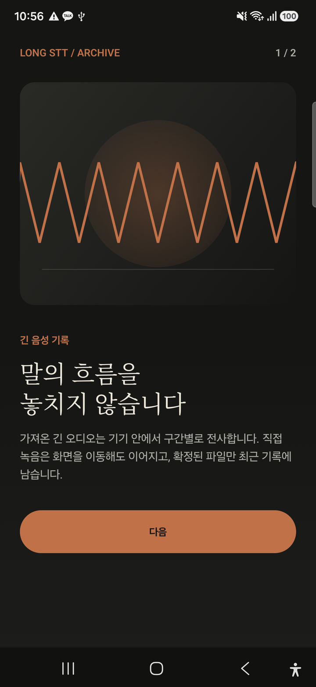
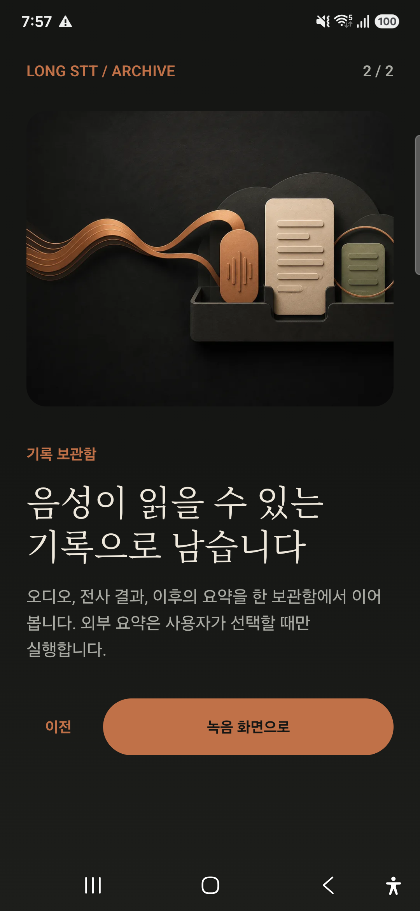
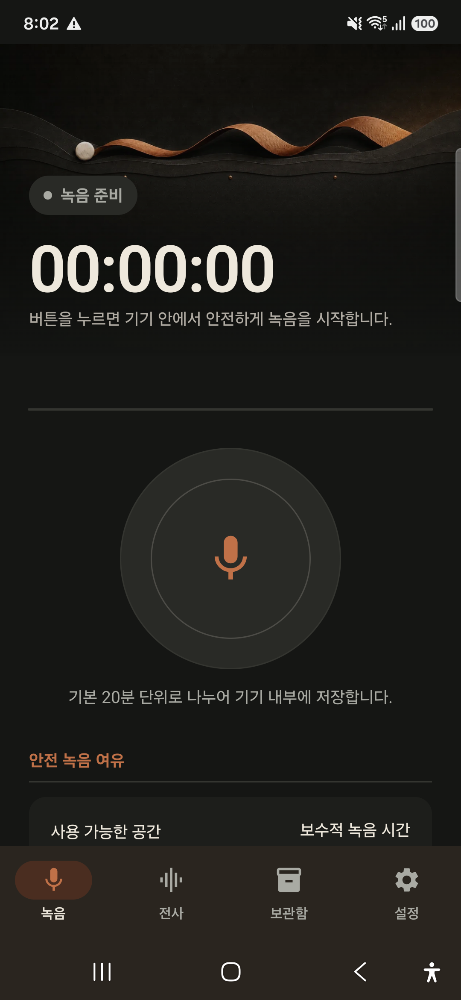
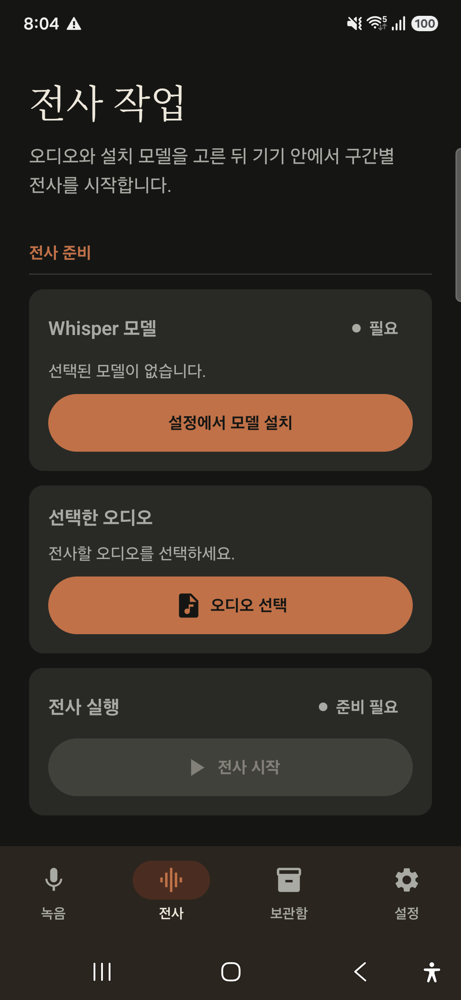
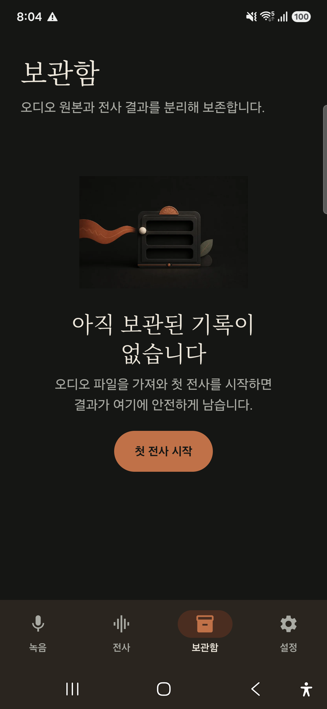
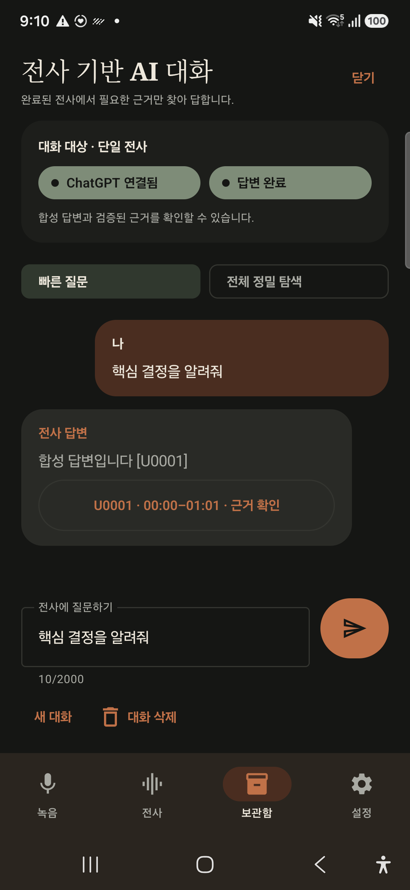
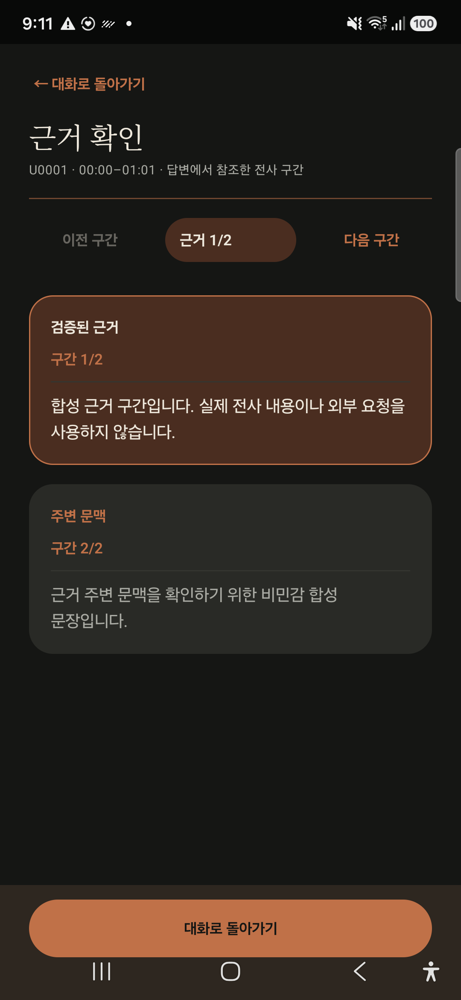
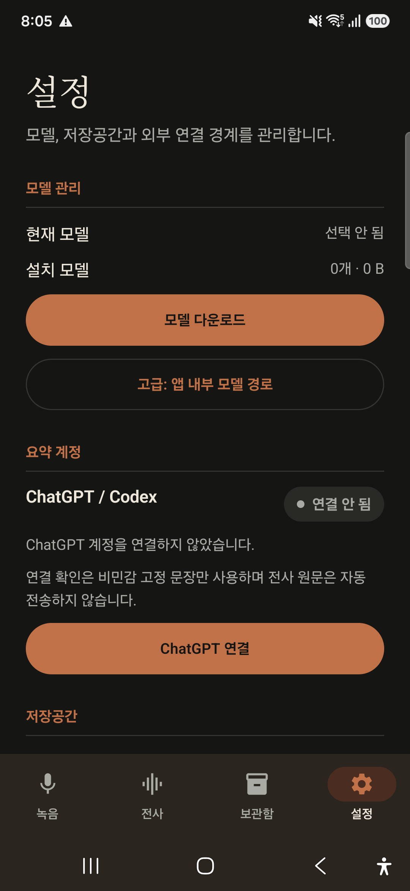

<div align="center">

# Long STT Android


### 긴 음성을 놓치지 않고, 기기 안에서 안전한 기록으로 남깁니다.

**KR** · 직접 녹음과 장시간 `whisper.cpp` 전사, 체크포인트 복구, 전체 보기·내보내기, 선택적 외부 요약과 전사 근거 채팅을 하나로 연결한 Android 앱입니다.

**EN** · An Android app for resilient long-form recording, on-device `whisper.cpp` transcription, checkpoint recovery, secure local archives, and optional transcript-grounded AI features.

<p>
  <code>android</code>
  <code>kotlin</code>
  <code>jetpack-compose</code>
  <code>speech-to-text</code>
  <code>stt</code>
  <code>whisper-cpp</code>
  <code>voice-recorder</code>
  <code>long-form-audio</code>
  <code>on-device-ai</code>
  <code>local-first</code>
</p>

<p>
  
  
  
  
</p>
<p>
  
  
  
  
</p>

[핵심 기능](#-핵심-기능) · [앱 화면](#-앱-화면) · [동작 구조](#-동작-구조) · [빌드](#-빌드와-실행) · [검증](#-검증-상태)

</div>

> [!NOTE]
> **2026-08-15 소스 기준선:** API 36, 모델 무결성, OAuth state-first, production signing pipeline까지 자동 검증했습니다. Samsung SM-S931N / Android 16 사용자·실장비 검증 기준일은 2026-08-14입니다. 전사와 녹음은 기기 안에서 처리하며, 외부 요약·전사 채팅·공유·TXT 저장은 사용자가 명시적으로 선택할 때만 앱 경계를 넘습니다.

> [!NOTE]
> **배포 정책:** Coreline은 권리 보유자로서 자체 릴리스의 배포 여부를 결정할 수 있습니다. Codex 관련 연동만으로 별도의 “Codex 정식 배포 승인”이 필요한 것은 아닙니다. 다만 배포 시에는 제3자 구성요소의 고지·라이선스와 사용하는 서비스의 적용 약관을 준수해야 합니다. 이 저장소의 개인 학습용 라이선스는 제3자에게 재배포 권한을 부여하지 않습니다.

## ✨ 핵심 기능

| 영역 | 현재 구현 |
|---|---|
| 🎙️ **직접 녹음** | microphone foreground service, 홈·탭 이동 뒤 백그라운드 유지, Android 13+ 알림 권한과 알림 정지 |
| 🧵 **안전 청크** | 기본 20분 rollover, 입력 장치 변경 시 기존 청크 확정 후 안전 분할, `.part → final`, `AtomicFile` checkpoint, SHA-256, quarantine·startup reconcile |
| 🎚️ **오디오 fallback** | AAC constrained → AAC default → 48kHz mono PCM WAV 순차 fallback |
| 📝 **장시간 전사** | `whisper.cpp` 기반 구간별 STT, foreground 진행, 청크 checkpoint, 취소·중단·복구 |
| 🔗 **녹음 그룹 STT** | READY 무결성 재검사, sequence 보장, 완전·부분 완료 구분, child 순차 실행 |
| 🗃️ **통합 보관함** | 녹음 그룹·단일 전사·원본 오디오 연결, 전체 전사 보기, 결과와 원본의 독립 삭제 |
| 📄 **외부 추출** | 완료 전사 전체를 UTF-8 TXT로 저장하거나 캐시 파일로 Android Sharesheet에 공유 |
| ✨ **선택적 요약** | 사용자 동의 후 구간 요약·통합·저장 진행률 표시, 목록 완료 상태와 요약 공유 |
| 💬 **전사 근거 채팅** | 완료 전사의 관련 구간만 보내는 빠른 질문, 사용자 선택 전체 정밀 탐색, 메시지 결합형 근거, 고정 입력창, 검증 근거·주변 문맥 확인 후 즉시 대화 복귀 |
| 🧭 **완료 결과 이동** | 완료 CTA 영구 복원, 정확한 결과 상세 열기, 완료 알림 딥링크, 삭제·손상 target 안전 폴백 |
| 🔐 **보안 경계** | OAuth token은 Android Keystore 보호·loopback state 선검증, Whisper 모델은 고정 revision/SHA-256 검증, 완료 target은 type/ID만 저장, 전사 원문 자동 전송 금지 |
| 📊 **벤치마크** | RTF, 처리 시간, 기기 정보, CSV v2 결과와 session identity 기록 |

## 📱 앱 화면

아래 **8장**은 최신 코드의 데이터 격리용 `deviceTest` 앱을 Samsung SM-S931N / Android 16에서 직접 캡처했습니다. 채팅 2장은 네트워크·OAuth·실제 저장소를 연결하지 않는 고정 합성 상태이며, 실제 전사·요약 본문, 파일 경로, 계정 식별 정보는 포함하지 않습니다.

### 첫 실행 소개

<table>
  <tr>
    <td align="center" width="50%">
      <br />
      <b>1 / 2 · 긴 음성 기록</b><br />
      직접 녹음과 구간별 전사 소개
    </td>
    <td align="center" width="50%">
      <br />
      <b>2 / 2 · 기록 보관함</b><br />
      오디오·전사·선택적 요약 소개
    </td>
  </tr>
</table>

### 주요 작업 화면

<table>
  <tr>
    <td align="center" width="33%">
      <br />
      <b>녹음 준비</b><br />
      저장 여유와 20분 청크 안내
    </td>
    <td align="center" width="33%">
      <br />
      <b>전사 준비</b><br />
      모델·오디오·실행 상태 분리
    </td>
    <td align="center" width="33%">
      <br />
      <b>통합 보관함</b><br />
      데이터 없는 초기 상태
    </td>
  </tr>
</table>

### 전사 근거 채팅

<table>
  <tr>
    <td align="center" width="50%">
      <br />
      <b>전사 기반 AI 대화</b><br />
      보관함 문맥을 유지하며 질문·답변·허용된 시간 근거 표시
    </td>
    <td align="center" width="50%">
      <br />
      <b>근거 확인과 대화 복귀</b><br />
      검증 근거와 주변 문맥을 분리하고 고정 버튼으로 즉시 복귀
    </td>
  </tr>
</table>

### 모델과 외부 연결 경계

<p align="center">
  <br />
  <b>설정 · 모델 관리 · 선택적 ChatGPT 연결</b>
</p>

## 🏗️ 동작 구조

```text
┌────────────────────┐     ┌────────────────────┐
│ 직접 녹음          │     │ 외부 오디오 가져오기│
│ RecorderService    │     │ MediaLibrary       │
└─────────┬──────────┘     └──────────┬─────────┘
          └──────────────┬────────────┘
                         ▼
              ┌──────────────────────┐
              │ TranscriptionService │
              │ whisper.cpp + chunks │
              └──────────┬───────────┘
                         ▼
              ┌──────────────────────┐
              │ Atomic checkpoint    │
              │ session / group      │
              └──────────┬───────────┘
                         ▼
              ┌──────────────────────┐
              │ 통합 보관함          │
              │ 상세 / 전체 보기     │
              └──────┬────────┬──────┘
                     │        │
       ┌─────────────┘        └──────────────┐
       ▼                                     ▼
┌──────────────────┐              ┌─────────────────────┐
│ UTF-8 TXT 저장   │              │ 사용자 동의 외부 요약│
│ 파일 Sharesheet  │              │ 진행 GUI / 결과 공유 │
└──────────────────┘              └──────────┬──────────┘
                                            ▼
                                 ┌─────────────────────┐
                                 │ 사용자 동의 전사 채팅│
                                 │ 빠른/정밀 · 근거 이동│
                                 └─────────────────────┘

전사 완료 ─▶ private target(type/ID) ─▶ CTA·완료 알림 ─▶ 정확한 보관함 상세
```

### 녹음·전사 안전 계약

1. UI는 권한·물리적 입력·최악 기준 저장공간을 확인합니다.
2. `RecorderController`는 명령만 전달하고 실제 Service 상태를 추측하지 않습니다.
3. Service는 시작 직후 적절한 foreground service type으로 승격합니다.
4. start·stop·rollover·backend 오류는 단일 actor에서 순서대로 처리합니다.
5. stop·오류 마감은 `NonCancellable + Dispatchers.IO`에서 실행합니다.
6. 실제 codec·sample rate·channel·duration과 SHA-256을 확인한 파일만 `READY`가 됩니다.
7. 그룹 coordinator는 native engine을 소유하지 않고 child 하나씩 기존 `TranscriptionService`에 전달합니다.
8. 완료 target은 전사 본문 없이 type/ID만 앱 private preferences에 보존합니다.
9. 삭제·손상된 완료 target은 임의의 최신 결과를 열지 않고 보관함 목록으로 폴백합니다.

## 🚀 빌드와 실행

### 요구 환경

| 도구 | 기준 |
|---|---|
| Android Studio / JDK | JDK 17, Android Studio JBR 사용 가능 |
| Android SDK | compile/target SDK 36, min SDK 26 |
| Android NDK | `28.2.13676358` |
| CMake | `3.22.1` |
| ABI | `arm64-v8a` |

### 1. 저장소와 whisper.cpp 준비

```bash
git clone https://github.com/coreline-ai/long-stt-android.git
cd long-stt-android

# 고정된 whisper.cpp source 준비와 commit 검증
./scripts/setup_whisper.sh
./scripts/setup_whisper.sh --verify-only
```

정확한 upstream commit과 native 규칙은 [`docs/BUILD_WHISPER.md`](docs/BUILD_WHISPER.md)를 확인하세요.

### 2. Debug 빌드·설치

```bash
# 앱과 native library를 포함한 Debug APK 생성
./gradlew :app:assembleDebug

# 기존 앱 데이터를 유지하며 연결 기기에 설치
adb install -r -t app/build/outputs/apk/debug/app-debug.apk
```

### 3. 전체 품질 게이트

```bash
# 앱·OAuth 테스트, Android lint, Debug/Release 산출물과 보안 gate 확인
./gradlew \
  :app:testDebugUnitTest \
  :codex-oauth-android:testDebugUnitTest \
  :app:lintDebug \
  :app:lintRelease \
  :app:assembleDebug \
  :app:assembleRelease \
  :app:assembleDeviceTest \
  :app:assembleDeviceTestAndroidTest \
  :app:bundleRelease \
  :app:verify16KbAlignment \
  :app:verifyReleaseSurface
```

### 4. 기본 사용 흐름

| 순서 | 작업 |
|---|---|
| 1 | 첫 실행 소개를 완료하고 `설정`에서 Whisper 모델을 설치합니다. |
| 2 | `녹음`에서 직접 녹음하거나 `전사`에서 오디오 파일을 가져옵니다. |
| 3 | 설치 모델과 오디오를 선택해 foreground 전사를 시작합니다. |
| 4 | 완료 CTA 또는 완료 알림의 **결과 보기**로 정확한 보관함 상세를 엽니다. |
| 5 | **전사 전체 보기**, **TXT 저장**, **파일로 공유**를 필요할 때 선택합니다. |
| 6 | 외부 요약은 안내를 확인하고 동의한 경우에만 시작합니다. |
| 7 | 완료 상세의 **AI에게 전사 질문**에서 안내에 동의한 뒤 빠른 질문 또는 전체 정밀 탐색을 선택합니다. |

## ✅ 검증 상태

| 검증 항목 | 최신 결과 |
|---|---|
| 앱 JVM / Robolectric / Compose | **256 passed / 0 failed / 0 skipped** · 하단 destination 선택, 모델 revision·SHA-256·host 정책과 완료 알림·TXT·공유 핵심 계약 포함 |
| OAuth 모듈 | **44 passed / 0 failed / 0 skipped** · state 누락/불일치 loopback callback이 정상 로그인을 선점하지 않는 회귀 포함 |
| Android lint / 산출물 | API 36 Release lint **0 errors / 37 warnings**, Release APK/AAB, 16KB alignment, Release surface gate 통과 |
| 배포 서명 파이프라인 | keyless gate fail-closed, 일회성 외부 JKS로 signed AAB·`jarsigner`·SHA-256 provenance 종단간 검증 후 key 삭제 |
| Samsung P0 | 데이터 보존 설치, 완료 CTA·알림 딥링크·cold start 복원 통과 |
| Samsung P1 자동 smoke | 격리 deviceTest 8건 통과·실마이크/AICore 5건 opt-in 건너뜀, OAuth Keystore 2건 통과 |
| 녹음 입력 전환 | 일반 입력 분류만 actor로 직렬화, 일시적 미확정 경로 확인, 변경 시 기존 청크 확정→새 청크 재시작, 200% 글자 안내 자동 검증 |
| 완료 상세 안정성 | 연속 클릭·가로/세로 회전·닫기·재진입 시 중복 dialog 없음 |
| 공유 안정성 | 요약/TXT chooser 취소, handler 없음·보안 예외·provider/쓰기 실패 처리 통과 |
| 장시간 가져오기 | bounded stream copy, `.part → final`, 실패 partial 정리 자동 검증 |
| 접근성 | font scale 200%·실제 360dp급 세로 폭에서 상태·CTA·공유 버튼 잘림 없음 |
| P2 전사 채팅 | 정책·원문 없는 AtomicFile·한국어 검색·digest·스트리밍·정밀 탐색·citation·회전 복원 자동 검증 |
| 근거 확인·복귀 | 채팅 내부 full-screen viewer, 검증 근거·주변 문맥 카드, 상·하단 즉시 복귀, system bar 안전 여백, draft/message/mode 보존, 잘못된 key 실패 안전 검증 |
| Samsung P2 합성 smoke | citation → 강조 viewer → 상단·하단·Android back 복귀, 200% 글자 도달성, 질문·답변·mode 보존, 서비스/wake lock 0 실제 터치 확인 |
| 장시간 녹음 | 20분 rollover, 1시간·6시간 녹음, 8시간 이상 soak 기준선 통과 |
| 백그라운드 그룹 STT | 4-child·19-child handoff와 coverage aggregate 통과 |
| 종료 자원 | 장시간 완료 후 Recorder/STT service와 held wake lock 잔류 없음 |
| 16KB page size | Debug/Release APK ZIP alignment와 arm64 ELF `0x4000` 검증 |
| 사용자·실장비 검증 | **2026-08-14 프로젝트 담당자 완료 확인.** 실제 OAuth lifecycle, 전사 기반 LLM 채팅, 외부 앱 전달, 장시간 import/STT·복구, 잠금·Bluetooth/USB·전화/알람을 포함한 사용자 조작 검증 완료 |

최신 상태는 [`docs/HANDOFF_20260815.md`](docs/HANDOFF_20260815.md)를 우선 확인하세요. 배포 전 보안 구현·검증은 [`dev-plan/implement_20260815_080304.md`](dev-plan/implement_20260815_080304.md)와 [`docs/SECURITY_REVIEW_20260815.md`](docs/SECURITY_REVIEW_20260815.md), 사용자·실장비 완료 기록은 [`docs/VERIFICATION_COMPLETION_20260814.md`](docs/VERIFICATION_COMPLETION_20260814.md)에 있습니다.

> [!NOTE]
> 2026-08-14에 프로젝트 담당자가 사용자 조작·실장비 검증을 모두 완료한 것으로 확인했습니다. 계정·전사 원문·외부 앱 대상 등 민감한 원시 증적은 저장소에 기록하지 않습니다. 과거 개발 계획의 “대기/미검증” 표기는 당시 실행 시점의 이력이며, 현재 상태는 완료 기록을 기준으로 합니다.

## 🚦 릴리스 준비 기준

| 구분 | 현재 상태 | 실제 릴리스 시 절차 |
|---|---|---|
| 기능·보안 소스 | **완료** | 코드 변경 시 영향 범위 회귀 검증 |
| 서명 파이프라인 | **구현·종단간 검증 완료** | Coreline upload key를 보호 환경에서 주입해 `:app:productionReleaseBundle` 실행 |
| 배포 운영 | 릴리스별 결정 | 배포 채널·버전·고지·약관·단계적 rollout 확인 |

기능·자동·사용자 조작 테스트는 완료 상태입니다. 위 항목은 선택한 릴리스에 필요한 운영 절차이며, Codex 관련 별도 공식 승인 gate는 아닙니다. keystore를 만들거나 저장하지 않고 CI secret 또는 로컬 환경 변수로만 주입하는 절차는 [`docs/PRODUCTION_SIGNING.md`](docs/PRODUCTION_SIGNING.md)를 확인하세요.

## 🔒 데이터와 외부 연결 경계

| 동작 | 앱 밖으로 나가는 데이터 |
|---|---|
| 녹음·전사 | 없음. 앱 내부 파일과 checkpoint만 사용 |
| 완료 CTA·알림 | 불투명한 결과 type/ID만 사용 |
| TXT 저장 | 사용자가 선택한 위치로 완료 전사 전체 복사 |
| 파일 공유 | 앱 캐시의 UTF-8 TXT를 사용자가 선택한 앱에 전달 |
| 외부 요약 | 동의 dialog를 확인한 완료 전사만 구간별 전송 |
| 요약 공유 | 저장된 최종 요약만 Android Sharesheet에 전달 |
| 전사 채팅 | 첫 인덱싱 동의 뒤 약 10,000자 구간을 순차 전송. 질문은 관련 구간 또는 사용자가 선택한 전체 정밀 탐색만 전송 |
| OAuth | token은 Android Keystore 기반 저장소로 보호 |

채팅 인덱스와 정밀 탐색 checkpoint에는 원문을 저장하지 않습니다. 로컬에는 파생 구간 요약·파생 발견 사항, 완료된 질문/답변, 검증된 unit ID, 제한된 대화 digest만 AtomicFile로 저장하며 요청은 고정 모델·`store=false`·tool-free 계약을 따릅니다.

## 📁 프로젝트 구조

```text
app/src/main/
├── AndroidManifest.xml
├── cpp/                              # JNI + whisper.cpp native bridge
└── java/com/stt/benchmark/
    ├── core/                         # 장시간 작업 단일 lease와 Debug-only logging
    ├── data/                         # STT/media/group/완료 target/export 저장 계약
    ├── chat/                         # 전사 채팅 정책·검색·원문 없는 저장소·ViewModel
    ├── recording/                    # recorder service/backend/checkpoint/recovery
    ├── service/                      # 장시간 TranscriptionService와 완료 알림
    ├── summary/                      # Codex OAuth·요약·공유 경계
    ├── ui/
    │   ├── onboarding/               # 2단계 제품 소개
    │   ├── recording/                # 직접 녹음과 실시간 상태
    │   ├── transcription/            # 모델·오디오·실행·완료 CTA
    │   ├── library/                  # 상세·전체 보기·TXT·요약·공유
    │   ├── chat/                     # 동의·빠른/정밀 질문·진행·근거 GUI
    │   └── settings/                 # 모델·저장공간·외부 연결
    └── whisper/                      # decoder / engine interface

codex-oauth-android/                  # source-parity OAuth 모듈
config/                               # 에셋 provenance와 font policy
dev-plan/                             # 단계별 구현·검증 계획
docs/                                 # 빌드·기기 QA·핸드오프·최신 8개 화면
scripts/                              # whisper 준비·오디오·실험 자동화
third_party/whisper.cpp.lock          # 고정 upstream commit
```

## 📚 관련 문서

| 문서 | 내용 |
|---|---|
| [`docs/README.md`](docs/README.md) | 현재 문서·역사 문서 구분과 읽기 순서 |
| [`docs/HANDOFF_20260815.md`](docs/HANDOFF_20260815.md) | 최신 프로젝트 구조·보안·운영 handoff |
| [`dev-plan/implement_20260819_160712.md`](dev-plan/implement_20260819_160712.md) | 개인 Google Drive 업로드 후속 개발 계획 · **구현 미착수** |
| [`dev-plan/implement_20260816_090437.md`](dev-plan/implement_20260816_090437.md) | 전사 기반 AI 대화·근거 viewer 디자인과 하단 내비게이션 정합성 |
| [`docs/BUILD_WHISPER.md`](docs/BUILD_WHISPER.md) | 고정 whisper.cpp source와 native build |
| [`docs/ANDROID_16KB_PAGE_SIZE.md`](docs/ANDROID_16KB_PAGE_SIZE.md) | Android 16KB page size 대응 |
| [`docs/PRODUCTION_SIGNING.md`](docs/PRODUCTION_SIGNING.md) | 외부 keystore 기반 signed AAB·provenance 생성 절차 |
| [`docs/SECURITY_REVIEW_20260815.md`](docs/SECURITY_REVIEW_20260815.md) | 배포 전 보안 검토와 적용 결과 |
| [`dev-plan/implement_20260815_080304.md`](dev-plan/implement_20260815_080304.md) | API 36·모델 무결성·OAuth state-first·production signing 구현 계획/결과 |
| [`docs/DEVICE_16KB_TEST_REPORT.md`](docs/DEVICE_16KB_TEST_REPORT.md) | APK/ELF 실측 결과 |
| [`docs/DEVICE_BASELINE_20260807_1917.md`](docs/DEVICE_BASELINE_20260807_1917.md) | Samsung 설치·장시간 검증 기준선 |
| [`dev-plan/implement_20260812_141045.md`](dev-plan/implement_20260812_141045.md) | 전체 전사 보기·UTF-8 TXT 저장·파일 공유 |
| [`dev-plan/implement_20260812_112348.md`](dev-plan/implement_20260812_112348.md) | 요약 상태 GUI와 요약 공유 |
| [`dev-plan/implement_20260812_174157.md`](dev-plan/implement_20260812_174157.md) | 완료 CTA 복원과 알림 딥링크 P0 |
| [`dev-plan/implement_20260813_085750.md`](dev-plan/implement_20260813_085750.md) | P1 자동 안정성·Samsung 격리 smoke |
| [`dev-plan/implement_20260813_100053.md`](dev-plan/implement_20260813_100053.md) | P2 전체 전사 기반 LLM 채팅 구현·자동 검증 |
| [`dev-plan/implement_20260813_160122.md`](dev-plan/implement_20260813_160122.md) | 검증된 근거 확인과 대화 즉시 복귀 GUI |

## ⚖️ 라이선스 및 사용 제한

> [!IMPORTANT]
> Coreline이 저작권을 보유하거나 재라이선스 권한을 가진 **프로젝트 고유 소스 코드**는
> [Coreline 개인 학습용 라이선스](LICENSE.md)에 따라 **개인적 학습·연구·평가 목적에 한하여** 사용할 수 있습니다.
> **상업적 사용과 배포는 금지합니다.**

- 개인은 비상업적 학습, 연구, 평가를 위해 로컬에서 코드를 열람·실행·수정할 수 있습니다.
- 유·무상을 불문한 판매·서비스 제공·제품 통합·사내 업무 활용 등 상업적 사용은 금지합니다.
- 소스·바이너리·수정본의 공개, 재배포, 재판매, 서브라이선스, 앱 스토어 등록은 금지합니다.
- 상업 이용, 외부 배포, 별도 공급 또는 공동 개발이 필요하면 **Coreline과 사전 서면 협의**가 필요합니다.
- 위 제한은 Coreline이 제3자에게 부여하는 이용 권한입니다. 저작권자·권리 보유자인 Coreline의 자체 릴리스·배포 결정을 제한하지 않습니다.
- `whisper.cpp` 등 제3자 구성 요소에는 각 저작권자 라이선스가 별도로 적용됩니다. 이 저장소 고지는 제3자 구성 요소의 권리를 제한하거나 재라이선스하지 않습니다.
- `codex-oauth-android`의 fixed upstream은 Coreline의 source-parity 구성요소입니다. 이 구성요소는 “Codex 정식 승인”을 자동으로 요구하지 않으며, 릴리스 시 제3자 고지·라이선스와 적용 서비스 약관을 함께 확인합니다.

---

<div align="center">
  <sub>Quiet Archive UI · on-device long-form speech workflow · Android</sub>
</div>
