<div align="center">

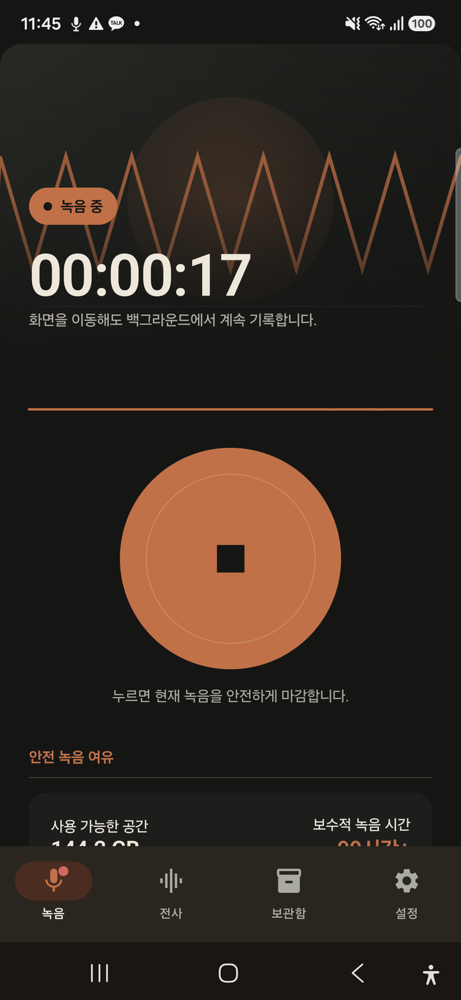

# Long STT Android

### 긴 음성을 놓치지 않고, 기기 안에서 안전한 기록으로 남깁니다.

백그라운드 직접 녹음부터 `whisper.cpp` 장시간 전사, 체크포인트 복구와 결과 보관까지 연결하는 Android 앱입니다.

<p>
  
  
  
  
</p>
<p>
  
  
  
  
</p>

[기능](#-핵심-기능) · [화면](#-앱-화면) · [구조](#-동작-구조) · [빌드](#-빌드와-실행) · [검증](#-검증-상태) · [문서](#-관련-문서)

</div>

> [!NOTE]
> 현재 Debug 기준입니다. 직접 녹음의 READY 청크는 MediaLibrary에 자동 등록되고,
> 녹음 그룹은 기존 단일 파일 foreground STT 경로를 sequence 순서로 사용합니다. Phase 7의 접근성·Release gate·20분 rollover·1시간/6시간 녹음·background 순차 STT와 8시간 이상 soak은 실제 기기에서 검증됐으며, 외부 입력/OAuth 실기기 증거는 아직 남아 있습니다.

## ✨ 핵심 기능

| 영역 | 구현 내용 |
|---|---|
| 🎙️ **직접 녹음** | microphone typed foreground service, 홈/탭 이동 뒤 백그라운드 유지, Android 13+ 알림 권한 요청과 앱·알림 정지 |
| 🧵 **안전 청크** | 기본 20분 rollover, `.part → final`, AtomicFile checkpoint, SHA-256, quarantine/reconcile |
| 🎚️ **오디오 fallback** | AAC constrained → AAC default → 48kHz mono PCM WAV 순차 fallback |
| 〽️ **실시간 화면** | service timer, 실제 amplitude, 상태 pill, 녹음 중 navigation indicator, reduced motion |
| 📝 **장시간 전사** | `whisper.cpp` 기반 구간별 STT, 진행 checkpoint, 취소·중단 후 terminal 저장 |
| 🔗 **녹음 그룹 STT** | READY 무결성 재검사, sequence 검증, 완전/partial 구분, 기존 단일 파일 Service 순차 실행 |
| 🗃️ **기록 보관함** | 녹음 부모 그룹·ordered child 결과·직접 녹음 원본을 연결하고 삭제 경계를 분리 |
| 🧭 **화면 책임 분리** | 전사·보관함·설정 route와 SavedStateHandle 기반 dialog state를 독립 관리 |
| 🔐 **외부 연결 경계** | OAuth token은 Android Keystore로 보호하며 전사 원문은 자동 전송하지 않음 |
| 📊 **벤치마크** | RTF, 처리 시간, 기기 정보, CSV v2 결과와 session identity 기록 |

## 📱 앱 화면

모든 이미지는 **Samsung SM-S931N / Android 16**에서 직접 캡처했습니다.
1~9·12번은 data-safe `deviceTest`, 13~15번은 transcript 없는 Phase 5 제품 Debug,
10~11·16~17번은 transcript·OAuth 정보가 없는 Phase 6 제품 Debug 데이터만 사용했습니다.

### 첫 실행 소개

<table>
  <tr>
    <td align="center" width="50%">
      <br />
      <b>1 / 2 · 긴 음성 기록</b>
    </td>
    <td align="center" width="50%">
      <br />
      <b>2 / 2 · 기록 보관함</b>
    </td>
  </tr>
</table>

### 직접 녹음 상태

<table>
  <tr>
    <td align="center" width="25%">
      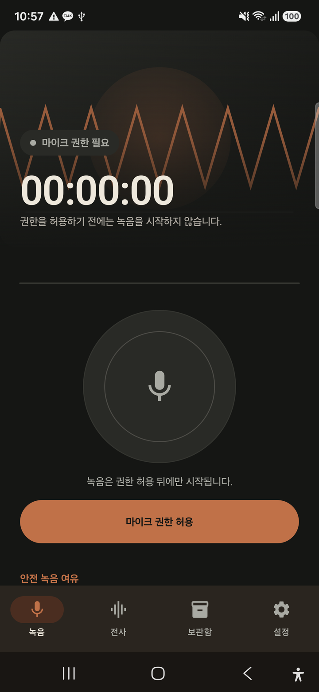<br />
      <b>권한 필요</b>
    </td>
    <td align="center" width="25%">
      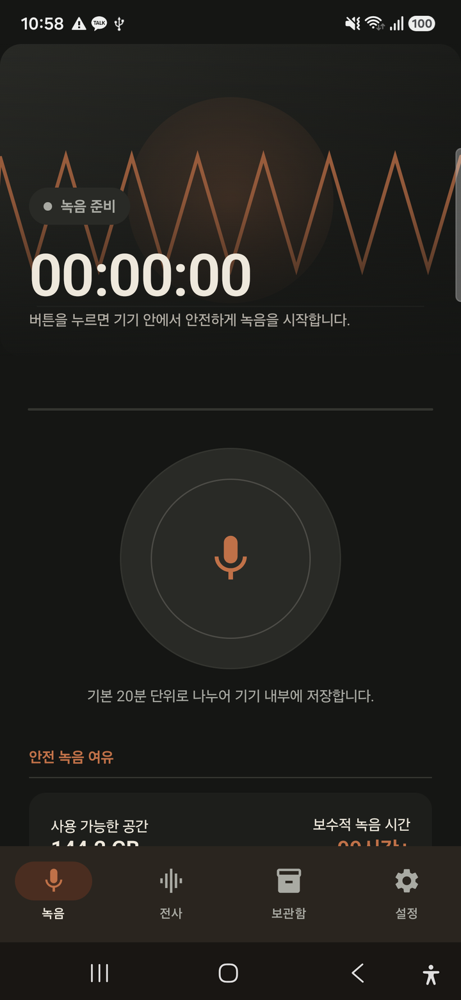<br />
      <b>녹음 준비</b>
    </td>
    <td align="center" width="25%">
      <br />
      <b>실제 녹음 중</b>
    </td>
    <td align="center" width="25%">
      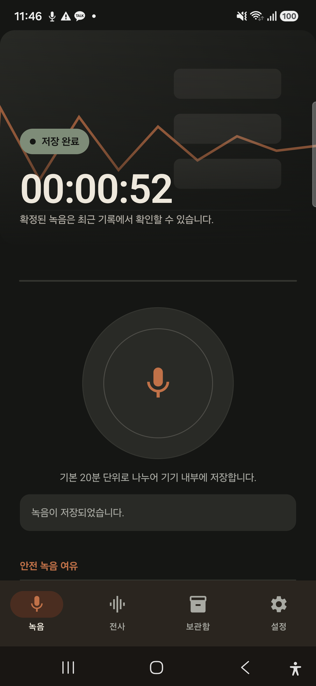<br />
      <b>안전 저장 완료</b>
    </td>
  </tr>
</table>

<details>
  <summary><b>Android 16 실제 마이크 권한 요청 화면 보기</b></summary>
  <br />
  <p align="center">
    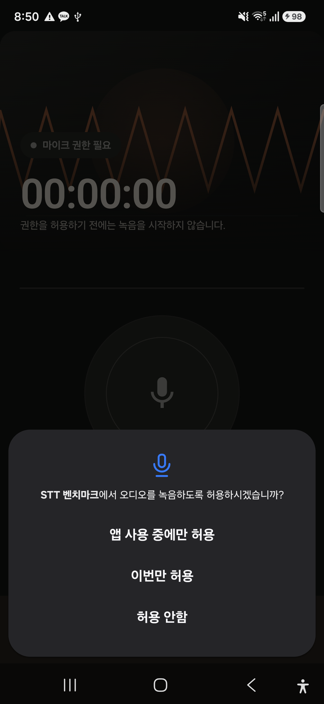
  </p>
</details>

### 전사·최근 녹음·보관함

<table>
  <tr>
    <td align="center" width="33%">
      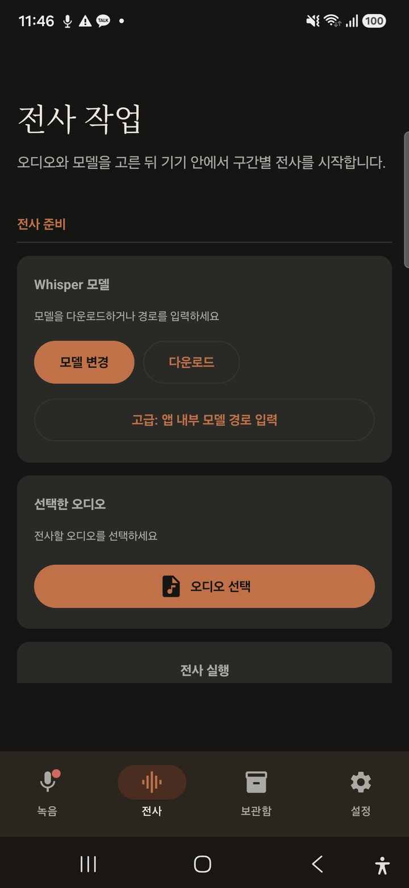<br />
      <b>전사 · 녹음 진행 표시</b>
    </td>
    <td align="center" width="33%">
      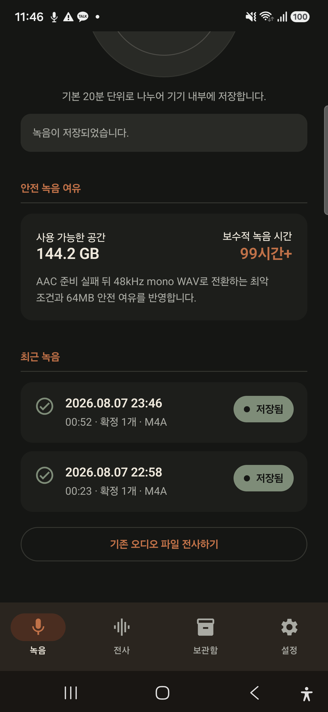<br />
      <b>저장공간 · 최근 녹음</b>
    </td>
    <td align="center" width="33%">
      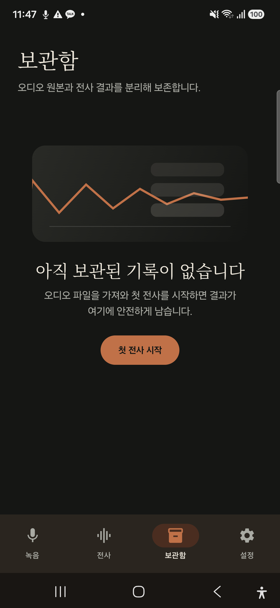<br />
      <b>통합 보관함</b>
    </td>
  </tr>
</table>

### 녹음 그룹 전사

<table>
  <tr>
    <td align="center" width="33%">
      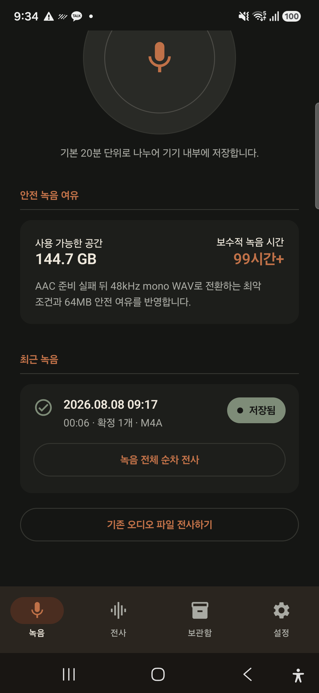<br />
      <b>READY 녹음 · 순차 전사</b>
    </td>
    <td align="center" width="33%">
      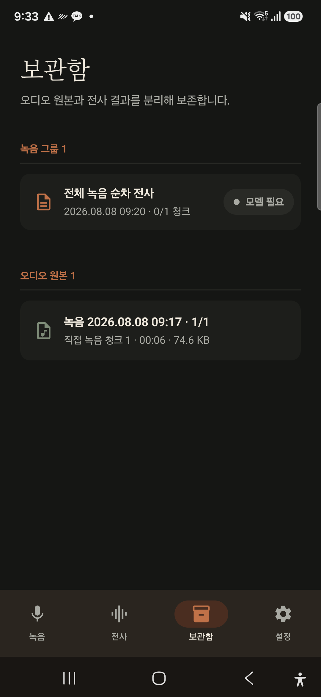<br />
      <b>부모 그룹 · 직접 녹음 원본</b>
    </td>
    <td align="center" width="33%">
      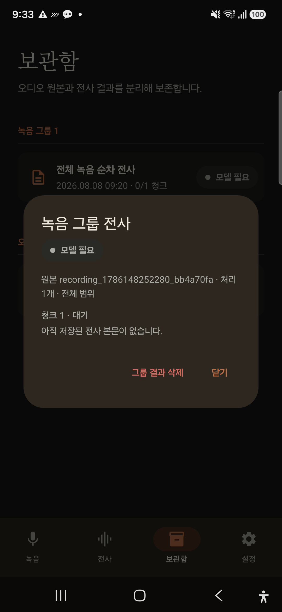<br />
      <b>원본 범위 · ordered child</b>
    </td>
  </tr>
</table>

### Phase 6 전사·모델 관리

<table>
  <tr>
    <td align="center" width="50%">
      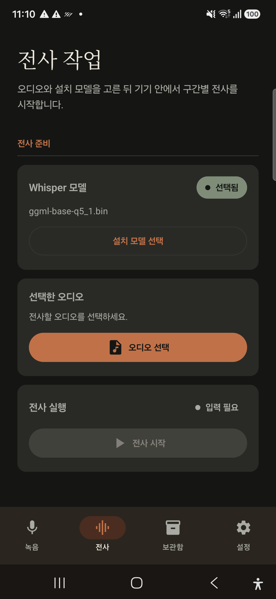<br />
      <b>모델 선택 · 오디오 · 실행 상태</b>
    </td>
    <td align="center" width="50%">
      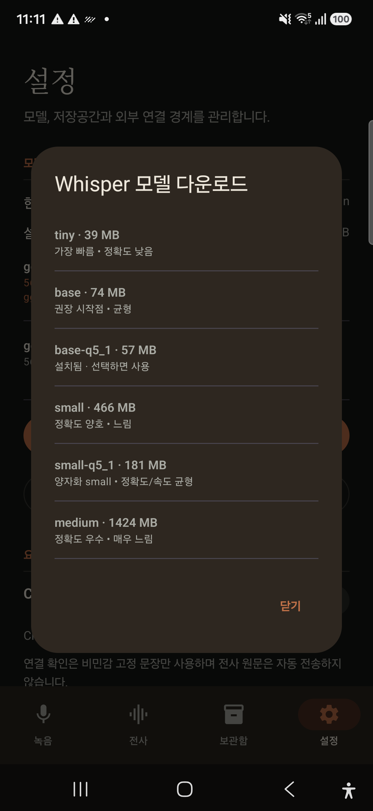<br />
      <b>설정 · 모델 catalog</b>
    </td>
  </tr>
</table>

### 설정과 처리 경계

<table>
  <tr>
    <td align="center" width="50%">
      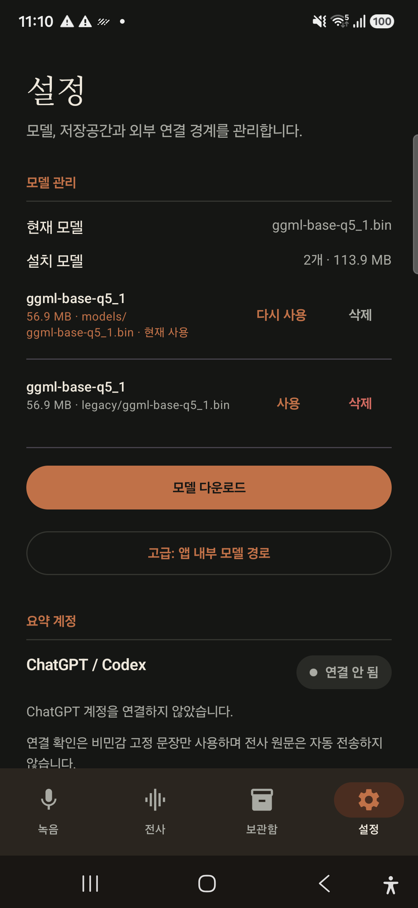<br />
      <b>모델 관리 · 요약 계정</b>
    </td>
    <td align="center" width="50%">
      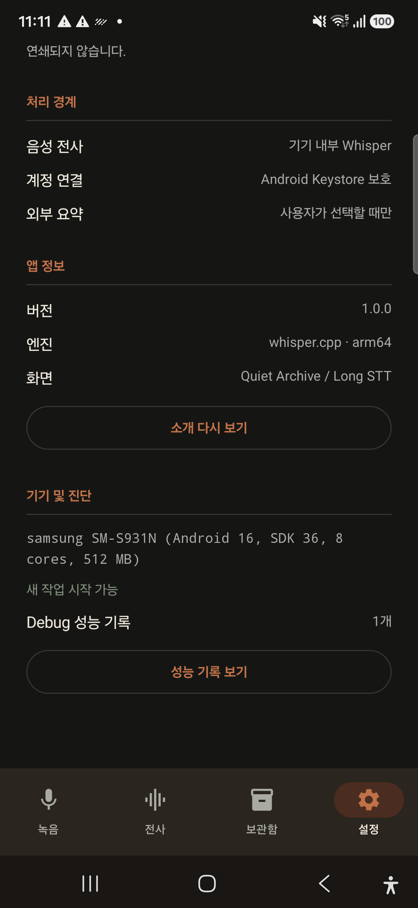<br />
      <b>처리 경계 · Debug 진단</b>
    </td>
  </tr>
</table>

## 🧭 동작 구조

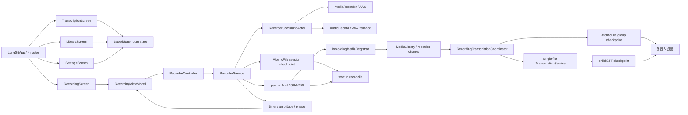

### 녹음 안전 계약

1. UI는 권한·물리적 입력·WAV 최악 기준 저장공간을 확인합니다.
2. `RecorderController`는 start/stop intent만 전달하고 실제 상태를 추측하지 않습니다.
3. Service는 시작 직후 microphone foreground service로 승격합니다.
4. START/STOP/rollover/backend 오류는 단일 actor에서 순서대로 처리합니다.
5. stop/error 마감은 `NonCancellable + IO`에서 실행합니다.
6. 실제 codec/sample rate/channel/duration과 SHA-256을 확인한 파일만 `READY`가 됩니다.
7. 중단·형식 오류 파일은 정상 녹음과 분리해 quarantine/recovery 대상으로 남깁니다.
8. READY 청크는 실제 파일 크기·해시를 재확인한 뒤 MediaLibrary에 idempotent 등록합니다.
9. 그룹 coordinator는 native engine을 소유하지 않고 child 하나씩 기존 `TranscriptionService`에 전달합니다.
10. 시작 복구는 프로세스 시작 이전 checkpoint/part만 다뤄 새 녹음과의 경쟁을 피합니다.

## 🚀 빌드와 실행

### 요구 환경

| 도구 | 기준 |
|---|---|
| Android Studio / JDK | JDK 17, Android Studio JBR 사용 가능 |
| Android SDK | compile/target SDK 34, min SDK 26 |
| Android NDK | `28.2.13676358` |
| CMake | `3.22.1` |
| ABI | `arm64-v8a` |

### 1. 저장소 준비

```bash
git clone https://github.com/coreline-ai/long-stt-android.git
cd long-stt-android

# 고정된 whisper.cpp source 준비 및 검증
./scripts/setup_whisper.sh
./scripts/setup_whisper.sh --verify-only
```

`whisper.cpp`의 정확한 commit과 네이티브 빌드 규칙은
[`docs/BUILD_WHISPER.md`](docs/BUILD_WHISPER.md)를 확인하세요.

### 2. Debug 빌드

```bash
./gradlew :app:assembleDebug
adb install -r app/build/outputs/apk/debug/app-debug.apk
```

### 3. 앱 사용

1. 첫 실행 소개를 완료합니다.
2. `녹음`에서 마이크 권한을 허용하고 직접 녹음을 시작합니다.
3. 다른 탭이나 홈 화면으로 이동해도 foreground service가 녹음을 유지합니다.
4. 앱 또는 notification에서 정지하고 확정 결과를 `최근 녹음`에서 확인합니다.
5. `최근 녹음`의 **녹음 전체 순차 전사**로 READY 청크를 순서대로 처리합니다.
6. 일부 보존 세션은 제외 범위를 확인한 뒤에만 partial 전사를 시작합니다.
7. 모델 설치·삭제는 `설정`, 설치 모델과 오디오 선택·실행은 `전사`에서 처리합니다.
8. 부모 그룹, child 결과, 원본은 `보관함`에서 함께 확인하되 각각 따로 삭제합니다.

## 🧪 검증 상태

| 검증 항목 | 현재 결과 |
|---|---|
| JVM unit / Robolectric Compose | **113 passed / 0 failed / 0 skipped** |
| Samsung Android instrumentation | **12 completed / AICore opt-in 1 assumption skipped** |
| 실제 마이크 smoke | 앱 정지·notification 정지·Activity 재생성 모두 `SAVED` |
| Phase 5 제품 smoke | 6초 M4A READY → MediaLibrary → base-q5_1 Service → group/child `COMPLETED` (원문 미출력) |
| Phase 6 route smoke | 전사·보관함·설정 분리, 모델 catalog, SavedState dialog, Debug 자동화 계약 통과 |
| 백그라운드 유지 | 홈 이동·회전 뒤 timer/session/chunk 복원, 4-child group STT의 background handoff와 coverage `COMPLETE` |
| 반복 lifecycle | Samsung에서 20× START/STOP, final 0-byte·비격리 `.part`·서비스 잔류 없음 |
| 20분 rollover | 2 M4A sequence와 MediaLibrary hash/order 일치, chunk 합계와 session elapsed 차이 296ms |
| 1시간 녹음·그룹 STT | 실제 `1:03:54` 녹음 4 M4A final, MediaLibrary/duration audit 및 4-child coverage aggregate `PASS` |
| 6시간 녹음·그룹 STT | 실제 약 6시간 녹음 19 M4A final, recording audit 및 background 19-child coverage aggregate `PASS` |
| 8시간 이상 soak | 8시간 minimum을 초과한 장시간 녹음, 35 M4A final, service/thermal/storage checkpoint와 recording audit `PASS` |
| 제품 notification stop | Android 16 알림 권한 dialog 허용 → background foreground notification 확장 → **녹음 정지** → 앱 재진입과 terminal cleanup 확인 |
| 화면 소등 lifecycle | 제품 녹음 중 display `Dozing`에서도 recorder service 유지, 화면 복귀 후 정상 종료 |
| 입력 경로 표시 | MediaRecorder/AudioRecord routing callback을 generic route로만 표시; Samsung 내장 마이크 제품 start/stop에서 `내장 마이크` 확인 |
| 외부 파일 import smoke | Android 시스템 파일 선택기에서 무음 WAV fixture를 가져와 선택 후 기존 단일 파일 foreground STT `COMPLETED` (원문 미출력) |
| Debug audit freshness | 기존 최상단 Debug audit 재실행도 최신 aggregate를 재계산하며, 19-child coverage 및 35-chunk recording consistency를 원문 없이 확인 |
| 종료 자원 | 6시간 19-child 그룹 완료 후 Recorder/STT service 없음, held wake lock `0` |
| 빌드 | Debug / Release / deviceTest / deviceTestAndroidTest assemble 성공 |
| 정적 검사 | Debug lint `0 errors / 24 warnings`, Release lint `0 errors / 27 warnings` |
| 16KB page size | Debug/Release APK ZIP alignment 및 arm64 ELF `0x4000` 기준 검증 |
| Release surface | Debug-only audit/probe activity와 `com.google.android.aicore`가 Release manifest에 없음 |
| 장시간 단일 파일 후보 감사 | Debug metadata-only audit에서 현재 제품 MediaLibrary의 6시간 이상 imported single-file 후보 없음 확인; 파일명·경로·내용 미출력 |
| Codex OAuth readiness | Samsung 설정 화면에서 현재 `signed out` 상태 확인; 실계정 login/restore/probe/logout은 미실행 |
| APK 설치 일치 | Debug local/installed SHA-256 `0d386be9…f281d6` 일치, Release unsigned SHA-256 `24a0cdc4…4c6835` |

실기기 기준선과 APK SHA-256은
[`docs/DEVICE_BASELINE_20260807_1917.md`](docs/DEVICE_BASELINE_20260807_1917.md)에 누적 기록합니다.

> [!WARNING]
> **릴리스 차단 항목:** 실제 잠금, Bluetooth/USB·전화/알람 interruption, 기존 장시간 단일 파일 STT 회귀, 실제 Codex/OAuth 계정 경계가 아직 완료되지 않았습니다. 현재 제품 MediaLibrary에는 6시간 이상 imported single-file 후보가 없으므로, 해당 원본이 준비되기 전에는 short smoke나 synthetic fixture로 대체하지 않습니다.

## 📊 벤치마크 결과

신규 측정 결과는 transcript 원문을 중복 저장하지 않는 CSV v2로 기록합니다.

```text
files/stt_benchmark_results_v2.csv
```

주요 컬럼은 `sessionId`, timestamp, device, engine, model, audio duration, elapsed time,
RTF와 speed multiplier입니다.

```bash
adb shell run-as com.stt.benchmark \
  cat files/stt_benchmark_results_v2.csv > results_v2.csv
```

> [!TIP]
> Snapdragon 8 Gen 3의 모델별 예상 처리 시간과 누락 청크·모델 비교 명령은
> [`docs/EXPERIMENT_PLAN.md`](docs/EXPERIMENT_PLAN.md)에 분리되어 있습니다.

## 🗂️ 프로젝트 구조

```text
app/src/main/
├── AndroidManifest.xml
├── cpp/                              # JNI + whisper.cpp native bridge
└── java/com/stt/benchmark/
    ├── core/                         # 장시간 작업 단일 lease
    ├── data/                         # STT/media/benchmark 저장소
    ├── recording/                    # service/backend/checkpoint/recovery
    ├── service/                      # 장시간 TranscriptionService
    ├── summary/                      # 격리된 Codex OAuth 연결 경계
    ├── ui/
    │   ├── onboarding/               # 2단계 제품 소개
    │   ├── recording/                # RecordingViewModel + 실시간 화면
    │   ├── transcription/            # 전사 화면 + route state + Debug 자동화 계약
    │   ├── library/                  # 오디오·전사 보관함
    │   └── settings/                 # 모델 관리·저장공간·외부 연결·Debug 진단
    └── whisper/                      # decoder/engine interface

codex-oauth-android/                  # source-parity OAuth 모듈
docs/                                 # 빌드·QA·계획·핸드오프
scripts/                              # whisper 준비·오디오·실험 자동화
third_party/whisper.cpp.lock          # 고정 upstream commit
```

## 🗺️ 개발 단계

- [x] Phase 0 — 적용 범위·기준선·재사용 경계
- [x] Phase 1 — Quiet Archive theme·온보딩·4개 route
- [x] Phase 2 — 녹음 checkpoint·파일 확정·격리·복구
- [x] Phase 3 — 실제 RecorderService·권한·notification
- [x] Phase 4 — RecordingViewModel·실시간 UI·접근성·화면 복원
- [x] Phase 5 — 녹음 그룹 → MediaLibrary → 순차 STT 통합
- [x] Phase 6 — 기존 전사/결과/설정 route 정리
- [ ] Phase 7 — 접근성·Release·20분 rollover·1시간·6시간 녹음과 background 순차 STT, 8시간 이상 soak·제품 notification stop 완료; 외부 입력·OAuth QA 진행 중

활성 체크리스트는
[`dev-plan/implement_20260808_113037.md`](dev-plan/implement_20260808_113037.md)를 기준으로 합니다.

## 📚 관련 문서

| 문서 | 내용 |
|---|---|
| [`docs/BUILD_WHISPER.md`](docs/BUILD_WHISPER.md) | 고정 whisper.cpp source와 native 빌드 |
| [`docs/ANDROID_16KB_PAGE_SIZE.md`](docs/ANDROID_16KB_PAGE_SIZE.md) | Android 16KB page size 대응 |
| [`docs/DEVICE_16KB_TEST_REPORT.md`](docs/DEVICE_16KB_TEST_REPORT.md) | APK/ELF 실측 결과 |
| [`docs/EXPERIMENT_PLAN.md`](docs/EXPERIMENT_PLAN.md) | 누락 청크·모델 비교 실험 |
| [`docs/ONDEVICE_M4A_MP3_STT_PLAN.md`](docs/ONDEVICE_M4A_MP3_STT_PLAN.md) | M4A/MP3 장시간 처리 계획 |
| [`docs/DEVICE_BASELINE_20260807_1917.md`](docs/DEVICE_BASELINE_20260807_1917.md) | Samsung 설치·데이터·hash 기준선 |
| [`docs/HANDOFF_20260807.md`](docs/HANDOFF_20260807.md) | 현재 구현 상태와 안전 경계 |
| [`docs/VOICE_TRACKER_FIND_FINAL_APPLICATION_REVIEW_20260807.md`](docs/VOICE_TRACKER_FIND_FINAL_APPLICATION_REVIEW_20260807.md) | 참조 GUI 최종 적용 검토 |

## ⚖️ 배포 및 라이선스 주의

- `whisper.cpp`는 upstream MIT 라이선스를 따릅니다.
- 현재 저장소 루트에는 프로젝트 전체를 포괄하는 `LICENSE` 파일이 없습니다.
- `codex-oauth-android`의 고정 upstream도 루트 라이선스가 확인되지 않아 내부 개발·검증 경계를 유지합니다.
- 프로젝트 코드와 참조 GUI/에셋의 공개·제3자 배포는 권리와 라이선스 확인 후 진행해야 합니다.

---

<div align="center">
  <sub>Quiet Archive UI · on-device long-form speech workflow · Android</sub>
</div>
