# implement_20260807_190921.md

- 작성 일시: 2026-08-07 19:09:21 KST
- 대상 브랜치: `main`
- 기준 커밋: `36e28aa`
- 계획 상태: Phase 1~5 안정화 주요 구현·검증 완료, Samsung 클린 재설치 완료, Phase 6 OAuth 독립 모듈 기술 검증 완료, Phase 7 앱 parity 다음
- 선행 계획: `implement_20260807_164038.md`

## 개발 목적

LongSTT Android를 이어서 개발할 수 있도록 현재 구현·빌드·기기 상태를 다시 검증하고, 다음 순서로 제품 위험을 낮춘다.

1. Samsung 실기기의 6시간 STT 기준 결과와 미완료 체크포인트를 먼저 보호한다.
2. fresh clone에서도 동일한 네이티브 소스로 빌드되는 재현 가능한 기준선을 만든다.
3. 취소·프로세스 종료·재개 시 체크포인트가 잘못 남는 STT 수명주기 결함을 먼저 해결한다.
4. 저장소 원자성, 자동 테스트, 구조화 진행 상태, STT/요약 상호 배제를 확립한다.
5. 검증된 upstream Codex OAuth 소스를 독립 모듈로 이식하고 실기기 패리티를 확보한다.
6. OAuth 보안 보강 후, 6시간 전사 결과를 계층 요약하는 기능과 UI를 구현한다.
7. 기존 6시간 체크포인트를 변경하지 않는 조건으로 최종 회귀·중단 복구·16KB QA를 완료한다.

이 문서는 기존 계획을 삭제하거나 완료 처리하지 않는다. 다만 상세 재검토에서 P0 결함이 확인되었으므로, 실제 작업 순서는 본 문서를 최신 기준으로 사용한다.

## 개발 범위

- 실기기 체크포인트 백업·무결성 기준선
- whisper.cpp 소스 고정 및 CMake/Gradle 빌드 재현성
- STT 취소·중단·재개·서비스 종료 상태 전이
- `AtomicFile` 기반 세션·미디어·벤치마크 저장소 복구
- 단위 테스트와 Android 계측 테스트 기반 확충
- 단일 STT 실행 경로 및 구조화 진행 상태
- Codex OAuth upstream Android 포팅, 앱 연동, 보안 보강
- 완료된 STT 세션의 계층 요약 계획·저장·재개·UI
- 10분 → 1시간 → 6시간 단계별 실기기 QA
- Debug/Release 빌드, lint, 16KB 페이지 정렬 검증

## 제외 범위

- 문서 가져오기/내보내기 기능 구현
- AICore/Gemini Nano 기반 온디바이스 요약의 제품 기능화
- 별도 Gateway 또는 앱 서버 배포
- 다중 LLM 제공자, 다중 계정, 모델 선택 UI
- 화자 분리, 타임스탬프 편집, WER 자동 평가
- 전체 UI 리디자인
- OAuth 이식과 동시에 수행하는 Kotlin/AGP/targetSdk 대규모 업그레이드
- 백업 없는 기존 6시간 체크포인트 수정·마이그레이션·삭제
- 검증 전 임시 whisper.cpp 빌드의 Samsung 설치

## 참조 문서

- `README.md`
- `docs/HANDOFF_20260807.md`
- `docs/BUILD_WHISPER.md`
- `docs/ANDROID_16KB_PAGE_SIZE.md`
- `docs/DEVICE_16KB_TEST_REPORT.md`
- `docs/RESULT_SUMMARY_5H_CHUNK.md`
- `docs/EXTERNAL_LLM_SUMMARY_6H.md`
- `docs/ONDEVICE_M4A_MP3_STT_PLAN.md`
- `dev-plan/implement_20260807_111158.md`
- `dev-plan/implement_20260807_133326.md`
- `dev-plan/implement_20260807_144941.md`
- `dev-plan/implement_20260807_161201.md`
- `dev-plan/implement_20260807_163104.md`
- `dev-plan/implement_20260807_164038.md`
- upstream 기준: `coreline-ai/alpine-llm-gateway` 커밋 `3389fcbf92207bb632dac002d7bb501d0901ff22`

## 상세 재검토 결과

### 확인된 기준선

| 항목 | 확인 결과 | 판단 |
|---|---|---|
| Git | `main`, `36e28aa`, `origin/main`과 동일, 작업 트리 clean | 코드 변경 전 기준선 확보 |
| Debug 빌드 | 임시 `/tmp/whisper.cpp` 사용 시 unit/Debug/androidTest assemble 성공 | 빌드는 가능하지만 재현 가능하지 않음 |
| Release 빌드 | unsigned Release APK 생성 성공 | 서명·소스 고정 전 배포 불가 |
| JVM 테스트 | `:app:testDebugUnitTest`가 `NO-SOURCE` | 핵심 상태·저장 로직 자동 검증 부재 |
| Android 테스트 | AICore probe만 존재, APK assemble만 확인 | 일반 제품 경로 계측 테스트 부재 |
| Release lint | 0 errors, 22 warnings | 경고 분류 필요 |
| Debug lint | 3 errors, 19 warnings | debug AICore manifest 및 FGS lint 조사 필요 |
| 16KB | Debug/Release arm64 SO 및 ZIP alignment 확인 | native 소스 고정 후 다시 검증해야 함 |
| Samsung 기준 세션 | 완료된 6시간 체크포인트 SHA-256 `0a8b0a524bf5d770a75133aefbf8df84d7c08791c2e15a72572fa7f8ab9a741e` | 변경 금지 기준 데이터 |
| Samsung 미완료 세션 | `RUNNING`, chunk 0개인 신규 체크포인트가 남아 있음 | 앱 재시작/설치 전 보호 조치 필요 |
| OAuth 임시 포트 | upstream 19개 소스, Kotlin 1.9 호환 패치 1건 후 43/43 unit 통과 | 독립 모듈 이식 가능성 확인 |
| OAuth 실기기 | Keystore test APK assemble만 완료 | 패리티 확정 전 |

### P0/P1 결함 및 계획 반영

| 우선순위 | 발견 사항 | 권장 대응 |
|---|---|---|
| P0 | `TranscriptionService` 취소 catch에서 취소된 coroutine 문맥으로 terminal 상태를 저장함 | `NonCancellable` 저장·상태 broadcast를 보장하고 상태 전이 테스트 추가 |
| P0 | Samsung에 서비스는 없지만 `RUNNING` 체크포인트와 `CANCELLING` UI가 남아 있음 | 설치·재시작 전에 백업, 수정 빌드 이후 명시적으로 복구 |
| P0 | CMake가 `/tmp/whisper.cpp`를 절대 경로로 참조함 | 검증된 commit을 저장소 상대 경로로 고정 |
| P0 | 최신 임시 whisper.cpp와 설치 APK의 native parity가 증명되지 않음 | 원래 commit 복구 또는 후보 commit 실기기 자격 검증 |
| P1 | `AtomicFile`로 쓰지만 여러 저장소가 원본 파일을 직접 읽음 | `openRead()`로 통일하고 중단 쓰기 복구 테스트 추가 |
| P1 | 단일 파일은 Service, 다중 파일은 ViewModel 엔진으로 실행됨 | 제품 STT 실행 경로를 하나로 통합하거나 legacy batch를 임시 비활성화 |
| P1 | broadcast 기반 진행 상태가 화면 재생성·재연결에 취약함 | 지속 가능한 structured snapshot/query 경로 구현 |
| P1 | benchmark CSV에 session ID 없이 전체 transcript를 중복 저장함 | v2 성능 레코드에 `sessionId` 추가, 신규 전체 텍스트 중복 중단 |
| P1 | 외부 `RUN_STT` receiver가 권한 없이 exported임 | debug 자동화 전용 또는 signature permission으로 제한 |
| P1 | 모델·오디오 복사 전에 해시·여유 공간 검증이 부족함 | 다운로드/복사 사전 검사 추가 |
| P1 | OAuth upstream 루트 LICENSE가 확인되지 않음 | 사내 재사용 승인과 출처 기록을 구현 시작 게이트로 지정 |

## 권장 개발 순서

```mermaid
flowchart LR
  A["1. 기기 데이터 보호"] --> B["2. 재현 가능한 빌드"]
  B --> C["3. STT 수명주기 수정"]
  C --> D["4. 저장소 무결성"]
  D --> E["5. 테스트·실행 경로 정리"]
  E --> F["6. OAuth 독립 모듈"]
  F --> G["7. OAuth 실기기 패리티"]
  G --> H["8. OAuth 보안 보강"]
  H --> I["9. 요약 데이터 계층"]
  I --> J["10. 계층 요약·UI"]
  J --> K["11. 최종 회귀·릴리스"]
```

| 순서 | Phase | 시작 조건 | 완료 핵심 조건 |
|---:|---|---|---|
| 1 | 기기 데이터 보호 | 없음 | 기준/미완료 세션 백업 및 해시 기록 |
| 2 | 빌드 재현성 | Phase 1 | fresh clone에서 동일 native source로 Debug/Release 성공 |
| 3 | STT 수명주기 | Phase 2 | 취소·중단·재개 terminal 상태가 항상 저장됨 |
| 4 | 저장소 무결성 | Phase 3 | AtomicFile 복구·schema·result identity 테스트 통과 |
| 5 | 실행 경로·테스트 | Phase 4 | 단일 실행 owner, structured progress, lint 기준 확립 |
| 6 | OAuth 독립 모듈 | Phase 5 및 재사용 승인 | upstream 43 unit + Keystore 계측 통과 |
| 7 | OAuth 패리티 | Phase 6 | 로그인·복원·갱신·로그아웃 실기기 통과 |
| 8 | OAuth 보안 | Phase 7 | redirect/storage/logging/concurrency 보강 회귀 통과 |
| 9 | 요약 데이터 계층 | Phase 8 | 6시간 입력 계획·저장·재개 unit 통과 |
| 10 | 계층 요약·UI | Phase 9 | 10분·1시간 단계 요약 성공 |
| 11 | 최종 QA | Phase 10 | 6시간 요약, STT 회귀, 16KB, release gate 통과 |

## 공통 진행 규칙

- 각 Phase의 구현·테스트·이슈 해소·완료 조건을 모두 확인한 뒤 다음 Phase로 이동한다.
- 기존 6시간 체크포인트는 read-only 입력으로 사용하며 원본을 재저장하지 않는다.
- ADB 명령은 기기 serial을 명시한다. Samsung 기준 serial은 `R3CY40PXCAP`이다.
- Samsung 설치·강제 종료·데이터 삭제 전에 서비스 상태, 백업, SHA-256을 다시 확인한다.
- transcript, OAuth code, access/refresh token, verifier, 사용자 식별자는 로그·CSV·스크린샷에 남기지 않는다.
- 한 시점에 STT 또는 요약 중 하나만 장시간 실행하도록 `DeviceWorkCoordinator`에서 배타 제어한다.
- 네이티브 소스는 commit과 provenance가 고정되지 않으면 release 검증 대상으로 인정하지 않는다.
- upstream 포트는 패리티 변경과 보안 변경을 분리한다. 먼저 동일 동작을 만든 후 작은 변경 단위로 보강한다.
- 테스트 수, APK hash, 체크포인트 hash, 실기기 결과를 각 Phase 완료 시 문서에 기록한다.
- 기존 계획 파일은 수정·삭제하지 않고, 실제 완료 내역은 본 계획 체크박스와 handoff에 동기화한다.

## Phase 1. 기기 데이터 보호와 작업 기준선 고정

### 구현 작업

- [x] Samsung에서 현재 앱 package/version, PID, foreground service, top activity를 다시 기록한다.
- [x] `stt_sessions`의 모든 파일을 안전한 host 디렉터리에 read-only 백업한다.
- [x] 백업 manifest에 기기 경로, 크기, 수정 시각, status, SHA-256만 기록하고 transcript는 기록하지 않는다.
- [x] 완료된 6시간 기준 체크포인트의 원본/백업 SHA-256 일치를 확인한다.
- [x] `RUNNING`이지만 chunk가 없는 미완료 세션을 별도 표시하고 원본은 아직 변경하지 않는다.
- [x] 설치 APK와 현재 저장소 산출물의 SHA-256 차이를 기록한다.
- [x] `/tmp/whisper.cpp` 후보 commit과 기존 설치 APK가 동일 빌드가 아님을 명시한다.
- [ ] 백업 디렉터리가 Git 추적 또는 cloud 자동 공유 대상이 아닌지 확인한다.

### 검증

- [x] `adb -s R3CY40PXCAP shell dumpsys activity services com.stt.benchmark`에서 활성 STT 서비스가 없음을 확인한다.
- [x] `adb -s R3CY40PXCAP shell run-as com.stt.benchmark ls -l files/stt_sessions` 목록과 backup manifest가 일치한다.
- [x] 완료된 6시간 checkpoint SHA-256이 `0a8b0a524bf5d770a75133aefbf8df84d7c08791c2e15a72572fa7f8ab9a741e`인지 확인한다.
- [x] 앱 재시작, APK 설치, 앱 데이터 삭제를 수행하지 않았음을 확인한다.

### 이슈 해소 조건

- [x] 백업 실패 또는 hash 불일치가 있으면 이후 모든 실기기 작업을 중단한다.
- [x] 미완료 세션은 Phase 3 수정 빌드 전까지 자동 재개시키지 않는다.

### Phase 완료 조건

- [x] 기기 데이터 기준선과 복원 경로가 문서화되었다.
- [x] Samsung 변경 작업을 시작해도 되는 명시적 gate가 만들어졌다.

## Phase 2. fresh-clone 네이티브 빌드 재현성

### 구현 작업

- [x] 이전 빌드에 사용한 whisper.cpp commit을 build metadata·기존 작업 환경에서 먼저 복구 시도한다.
- [x] 복구할 수 없으면 후보 `8631825d41a2712268813981a9550b04a3f225e5`를 미검증 후보로 등록한다.
- [x] 검증된 whisper.cpp를 `third_party/whisper.cpp` submodule 또는 동등한 locked source 방식으로 고정한다.
- [x] `app/src/main/cpp/CMakeLists.txt`의 `/tmp/whisper.cpp` 절대 경로를 제거한다.
- [x] commit, remote, local patch, build flags를 `docs/BUILD_WHISPER.md` 또는 provenance 문서에 기록한다.
- [x] Android Studio JBR/Java 17과 Android SDK 설정 방법을 fresh clone 기준으로 정리한다.
- [x] native build가 네트워크나 개발자 개인 디렉터리에 암묵적으로 의존하지 않게 한다.
- [x] 모델 파일 다운로드와 native source 준비 절차를 분리한다.

### 검증

- [x] 깨끗한 checkout에서 `./gradlew :app:testDebugUnitTest :app:assembleDebug :app:assembleDebugAndroidTest`가 성공한다.
- [x] 깨끗한 checkout에서 `./gradlew :app:assembleRelease`가 성공한다.
- [x] 산출 APK의 commit, source provenance, SHA-256을 기록한다.
- [x] `zipalign -c -P 16 -v 4`로 Debug/Release APK 정렬을 확인한다.
- [x] arm64-v8a `.so`의 ELF LOAD alignment가 `0x4000` 이상인지 확인한다.
- [x] 최소 오디오 fixture에서 native load/transcribe smoke test를 수행한다.

### 이슈 해소 조건

- [x] 기존 commit을 복구하지 못한 경우 후보 commit은 Samsung 설치 전 보조 기기 또는 emulator에서 검증한다.
- [x] whisper.cpp local patch가 필요하면 patch 파일과 적용 이유를 저장소에 포함한다.

### Phase 완료 조건

- [x] `/tmp`나 개인 경로 없이 누구나 동일 commit으로 APK를 만들 수 있다.
- [x] 고정된 native 기준선으로 Phase 3 수정 빌드를 생성할 수 있다.

## Phase 3. STT 취소·중단·재개 수명주기 수정

### 구현 작업

- [x] STT 상태 전이를 순수 Kotlin 상태 모델로 분리한다.
- [ ] 허용 상태를 `IDLE/RUNNING/CANCELLING/INTERRUPTED/CANCELLED/FAILED/COMPLETED`로 명시한다.
- [x] 사용자 취소와 예기치 않은 프로세스/서비스 중단을 구분한다.
- [x] cancellation catch의 terminal 저장과 broadcast를 `NonCancellable + Dispatchers.IO` 등으로 보장한다.
- [x] `ACTION_CANCEL` 수신 시 active job이 없어도 미완료 checkpoint를 안전한 terminal 상태로 정리할 수 있게 한다.
- [x] `ACTION_RESUME`은 실제 재개 가능 status, audio, model, chunk 경계를 검증한 후에만 시작한다.
- [x] `START_STICKY` null intent 자동 재개의 조건과 사용자 의도를 명확히 한다.
- [x] `onDestroy`, engine release, wake lock release, terminal save 순서를 결정적으로 정리한다.
- [x] 오래된 `RUNNING` 세션을 startup에서 `INTERRUPTED`로 조정하는 reconciliation을 구현한다.
- [ ] 앱 UI가 terminal 상태를 받은 뒤 `CANCELLING`에서 빠져나오도록 한다.

### 테스트

- [ ] 취소 직전, decode 중, chunk 저장 직후 취소 테스트를 추가한다.
- [x] 취소 시 마지막 완료 chunk까지만 보존되고 status가 `CANCELLED`인지 검증한다.
- [x] process/service 중단 시 status가 `INTERRUPTED`이고 재개 가능 여부가 올바른지 검증한다.
- [ ] idle 상태의 `ACTION_CANCEL`이 service를 남기지 않는지 검증한다.
- [ ] 중복 `ACTION_RESUME`과 중복 `ACTION_CANCEL`의 idempotency를 검증한다.
- [ ] 없는 audio/model, 잘못된 currentChunk, 이미 완료된 세션 재개를 거부하는지 검증한다.

### 실기기 복구

> 기존 signer blocker는 `2026-08-07 20:01 KST` 사용자의 명시적 승인에 따른 uninstall/reinstall로 해소했다. 삭제 전 4개 checkpoint는 Git 제외 로컬 백업과 hash 대조를 완료했다. 완료 6시간 checkpoint는 현재 기기에 없고 백업에만 존재한다. 보조 태블릿에서는 `COMPLETED` native smoke와 실행 중 취소 → `CANCELLED`/service 종료를 검증했다.

- [x] Phase 1 백업과 Phase 2 APK hash를 다시 확인한다.
- [x] 수정 APK 설치 전 Samsung의 활성 service가 없는지 재확인한다.
- [ ] 앱 시작 시 미완료 `RUNNING` 세션을 자동 전사하지 않고 `INTERRUPTED` 또는 사용자 확인 상태로 정리한다.
- [ ] 미완료 세션 정리 후 완료된 6시간 기준 checkpoint hash가 변하지 않았는지 확인한다.

### 이슈 해소 조건

- [x] terminal 저장 실패 시 조용히 무시하지 말고 재시도/오류 상태를 남긴다.
- [x] 오래된 session schema를 읽지 못하면 원본을 덮어쓰지 않고 오류를 표시한다.

### Phase 완료 조건

- [ ] 취소 후 UI와 checkpoint가 더 이상 `RUNNING/CANCELLING`에 영구 고착되지 않는다.
- [ ] 강제 중단 후 재실행에서 재개 또는 명시적 중단 처리 결과가 예측 가능하다.

## Phase 4. 저장소 원자성·스키마·결과 식별자

### 구현 작업

- [x] `TranscriptionSessionStore.load()`를 `AtomicFile.openRead()` 기반으로 변경한다.
- [x] `MediaLibraryStore`와 `BenchmarkRecorder`의 atomic writer/reader 대칭성을 확보한다.
- [x] interrupted write의 `.bak` 복구 동작을 저장소별로 검증한다.
- [x] STT session schema version과 backward-compatible reader 정책을 명시한다.
- [ ] 새 session에 audio/model fingerprint와 실행 provenance를 저장한다.
- [x] 완료된 기존 6시간 session JSON은 마이그레이션 명목으로 재저장하지 않는다.
- [x] benchmark CSV v2에 `sessionId`를 추가하고 성능 지표 중심으로 제한한다.
- [x] 신규 benchmark record에는 전체 transcript를 중복 저장하지 않는다.
- [x] v1 CSV reader 호환과 v2 writer를 분리한다.
- [x] 결과 삭제를 `audioName + model + text`가 아니라 stable ID로 수행한다.
- [ ] 모델 다운로드·오디오 import 전에 예상 크기와 usable space를 검사한다.
- [ ] 모델 artifact에 SHA-256 검증 정보를 추가한다.

### 테스트

- [x] AtomicFile 정상 저장/읽기/교체 테스트를 추가한다.
- [x] 원본 손상 + backup 존재, 쓰기 도중 중단, 빈 파일 복구 테스트를 추가한다.
- [x] unknown schema version에서 원본 보존과 안전한 오류 처리를 검증한다.
- [ ] v1/v2 benchmark 혼합 읽기와 ID 기반 삭제를 검증한다.
- [x] transcript가 신규 CSV에 포함되지 않는지 검증한다.
- [ ] 저장 공간 부족과 model hash 불일치 시 안전하게 실패하는지 검증한다.

### 이슈 해소 조건

- [ ] 기존 v1 CSV를 일괄 변경해야 하면 별도 백업과 migration 계획을 먼저 작성한다.
- [x] 개인정보가 포함된 fixture는 synthetic text로 교체한다.

### Phase 완료 조건

- [x] atomic write 주장과 실제 read/recovery 동작이 일치한다.
- [x] session/result identity가 모호하지 않고 transcript 중복 저장이 중단된다.

## Phase 5. 단일 실행 경로·구조화 진행 상태·자동 품질 게이트

### 구현 작업

- [x] `TranscriptionPlan`을 도입해 chunk 수·경계·coverage 계산을 UI와 Service가 공유한다.
- [x] 단일 파일과 다중 파일의 생산 STT 실행 owner를 Service로 통합한다.
- [x] 즉시 통합이 어렵다면 legacy ViewModel batch를 숨기거나 debug-only로 제한한다.
- [x] ViewModel에서 모델을 선행 load/release하는 중복 engine ownership을 제거한다.
- [ ] `DeviceWorkCoordinator`를 도입해 STT와 향후 요약이 동시에 시작되지 않게 한다.
- [ ] 진행 상태를 phase, current/total, elapsed, ETA, current item, recoverable status로 구조화한다.
- [x] Activity 재생성·재연결 시 Service 또는 checkpoint로부터 최신 snapshot을 조회한다.
- [x] `ACTION_RESUME`이 이미 실행 중이면 현재 snapshot을 회신한다.
- [x] exported `RUN_STT` receiver를 debug-only 또는 signature permission으로 제한한다.
- [x] AICore probe의 debug manifest/dependency를 제품 Debug lint와 분리한다.
- [x] wake lock 사용을 제한하고 release 누락이 없도록 한다.

### 테스트

- [x] `599999/600000/600001ms` chunk 경계와 전체 coverage 테스트를 추가한다.
- [x] 0초, 짧은 파일, 정확히 10분, 6시간 계획이 overlap/gap 없이 생성되는지 검증한다.
- [ ] Activity recreation 중 동일 진행 snapshot이 복구되는지 계측 테스트한다.
- [ ] STT 실행 중 두 번째 STT와 summary 시작이 거절되는지 검증한다.
- [x] `./gradlew :app:testDebugUnitTest`가 `NO-SOURCE`가 아니며 모든 테스트가 통과한다.
- [x] `./gradlew :app:lintDebug :app:lintRelease`가 error 0으로 완료된다.
- [ ] Release lint warning을 수용/수정/별도 upgrade 항목으로 분류한다.

### 이슈 해소 조건

- [x] targetSdk·dependency upgrade는 이 단계 안정화와 섞지 않고 후속 계획으로 분리한다.
- [x] 외부 automation이 반드시 필요하면 release에 노출하지 않는 별도 debug app/action을 사용한다.

### Phase 완료 조건

- [x] 생산 STT에는 하나의 장시간 실행 경로와 하나의 상태 모델만 존재한다.
- [x] Debug/Release 공통 품질 gate와 핵심 JVM/계측 테스트가 작동한다.

## Phase 6. Codex OAuth 독립 Android 모듈 이식

### 구현 시작 게이트

- [ ] upstream 소스의 사내 재사용 권한과 배포 가능 범위를 확인한다.
- [x] upstream root LICENSE 부재를 확인하고 내부 검증 전용/외부 배포 blocker로 문서화한다.
- [x] 고정 commit `3389fcbf92207bb632dac002d7bb501d0901ff22`와 19개 대상 파일 목록을 확정한다.

### 구현 작업

- [x] `:codex-oauth-android` 독립 Android library 모듈을 생성한다.
- [x] upstream 19개 파일을 package 경계와 책임을 유지해 이식한다.
- [x] `AndroidX Browser 1.8.0`, coroutines 등 실제 필요한 최소 dependency만 추가한다.
- [x] Kotlin 1.9 non-exhaustive `when` 호환 패치 1건을 최소 diff로 반영한다.
- [x] `UPSTREAM.md`에 remote, commit, 파일 목록, package mapping, 패치 이유를 기록한다.
- [x] OAuth storage interface와 Android Keystore 구현을 앱과 분리한다.
- [x] Alpine runtime/proot/chat 등 불필요 dependency를 포함하지 않는다.

### 테스트

- [x] OAuthCore 18개 unit 테스트를 이식·통과시킨다.
- [x] OAuthHttpLlmBridge 8개 unit 테스트를 이식·통과시킨다.
- [x] StreamingBridge 4개 unit 테스트를 이식·통과시킨다.
- [x] CodexResponsesOAuthAdapter 6개 unit 테스트를 이식·통과시킨다.
- [x] GatewayOperations 7개 unit 테스트를 이식·통과시킨다.
- [x] 총 43개 upstream unit 테스트가 동일 기대값으로 통과한다.
- [x] Android Keystore 저장/로드/삭제, preference 평문 비노출, key non-exportability 계측 테스트 2개를 Samsung에서 실행한다.
- [ ] 실제 앱 uninstall/reinstall 경계의 credential 소거 동작은 앱 연동 후 Phase 7 logout/reinstall 시나리오에서 검증한다.
- [x] 모듈 AAR과 androidTest APK가 현 프로젝트 toolchain에서 assemble된다.

### 이슈 해소 조건

- [x] 패리티 단계에서는 redirect/storage/model 기본값을 임의로 보강하지 않는다.
- [x] 추가 호환 패치는 모두 `UPSTREAM.md`와 테스트에 1:1로 연결한다.

### Phase 완료 조건

- [x] 앱에 연결하지 않은 상태에서 upstream 패리티와 provenance가 독립적으로 검증된다.
- [x] 재사용 승인과 보안 경계가 release blocker로 추적된다.

## Phase 7. 앱 OAuth 로그인 패리티와 실기기 검증

### 구현 작업

- [ ] 앱 전용 `CodexOAuthManager/Factory` wrapper를 추가한다.
- [ ] ActivityResult 기반 browser launch와 callback 전달을 연결한다.
- [ ] 최소 로그인 화면에 로그인, 연결 상태, 로그아웃만 추가한다.
- [ ] 기존 upstream 모델/endpoint 기본값을 패리티 단계에서 유지한다.
- [ ] 앱 재시작 시 저장 세션 복원과 만료 token refresh를 수행한다.
- [ ] 로그아웃 시 access/refresh token과 민감 metadata를 제거한다.
- [ ] OAuth가 STT 서비스·체크포인트를 변경하지 않도록 모듈 경계를 유지한다.

### 실기기 테스트

- [ ] 시험 직전 Git 제외 Phase 1 backup tar와 6시간 checkpoint 백업 hash를 재확인한다.
- [ ] 클린 설치된 앱에 `stt_sessions`가 없음을 시험 전후 확인하고 백업 원문을 자동 복원하지 않는다.
- [ ] 로그인 1회에 browser/동의 화면이 불필요하게 중복 열리지 않는지 확인한다.
- [ ] 성공 callback 후 앱 복귀와 연결 상태 표시를 확인한다.
- [ ] 앱 process 종료·재시작 후 세션 복원을 확인한다.
- [ ] token 만료 또는 모의 만료 후 refresh 성공을 확인한다.
- [ ] 로그아웃 후 저장 token 제거와 재로그인 가능 여부를 확인한다.
- [ ] 취소, 잘못된 state, callback 중복, 네트워크 실패 UI를 확인한다.
- [ ] logcat과 앱 파일에 token/code/verifier가 평문으로 남지 않는지 확인한다.

### 이슈 해소 조건

- [ ] 실제 등록된 redirect/client metadata의 배포 권한을 재확인한다.
- [ ] 실기기 실패 시 보안 보강을 섞지 않고 upstream 대비 diff부터 좁힌다.

### Phase 완료 조건

- [ ] 로그인·복원·refresh·로그아웃 기본 흐름이 Samsung에서 패리티로 동작한다.
- [ ] STT 앱 빌드·콜드 스타트·서비스 실행 기능에 회귀가 없고 OAuth 시험이 STT 저장소를 생성·변경하지 않는다.

## Phase 8. OAuth 저장·redirect·응답 경계 보안 보강

### 구현 작업

- [ ] authorization redirect 허용 정책을 명시하고 필요 시 HTTPS만 허용한다.
- [ ] localhost callback host/port/path를 실제 등록값으로 좁힌다.
- [ ] 일반 `127.0.0.1`/`localhost` broad intent-filter를 최소화한다.
- [ ] 보안상 필요한 preference 저장은 callback 반환 전에 동기적으로 완료한다.
- [ ] token refresh single-flight와 동시 요청 경합을 처리한다.
- [ ] HTTP connect/read/write timeout과 응답 최대 크기를 설정한다.
- [ ] error body와 SSE buffer 최대 크기를 설정한다.
- [ ] `max_output_tokens`를 명시하고 summary 호출 경계에서 제한한다.
- [ ] token/code/verifier/header/error body redaction을 공통 logger에 적용한다.
- [ ] malformed callback, state mismatch, PKCE mismatch를 명확히 거부한다.

### 테스트

- [ ] redirect downgrade, 허용되지 않은 host/path, 중복 callback 테스트를 추가한다.
- [ ] preference async ordering을 재현하고 보강 후 통과를 확인한다.
- [ ] concurrent refresh, timeout, oversized response/SSE 테스트를 추가한다.
- [ ] redaction 테스트에서 금지 문자열이 로그에 포함되지 않는지 확인한다.
- [ ] 보강 패치마다 upstream 43 unit과 Phase 7 실기기 흐름을 재실행한다.

### 이슈 해소 조건

- [ ] upstream 패리티 변경과 별도 hardening diff를 구분해 review 가능하게 유지한다.
- [ ] OAuth client/redirect 등록 정책이 공개 배포에 부적합하면 release를 차단한다.

### Phase 완료 조건

- [ ] 저장·redirect·네트워크·로깅 경계의 알려진 위험이 테스트로 고정된다.
- [ ] OAuth 보강 후에도 실기기 로그인 수명주기가 유지된다.

## Phase 9. 6시간 요약 입력 계획·세션 저장·재개 기반

### 구현 작업

- [ ] 요약 대상은 `COMPLETED`이며 chunk coverage가 완전한 STT session만 허용한다.
- [ ] 기존 STT checkpoint를 immutable source로 읽고 canonical SHA-256을 계산한다.
- [ ] `SummaryInputPlanner`를 구현해 10분 STT chunk 38개를 약 30분 단위 unit 13개로 묶는다.
- [ ] 빈/손상/중복/누락 chunk와 잘못된 duration coverage를 거부한다.
- [ ] `SummarySession`에 source session ID/hash, planner version, prompt version, model, unit 상태를 저장한다.
- [ ] `SummarySessionStore`를 `AtomicFile.openRead()` 기반으로 구현한다.
- [ ] 상태를 `PENDING/RUNNING/INTERRUPTED/FAILED/COMPLETED/CANCELLED`로 정의한다.
- [ ] summary text는 별도 저장하고 OAuth token·원문 중복 저장을 금지한다.
- [ ] `DeviceWorkCoordinator`를 통해 STT 실행 중 summary 시작을 거절한다.
- [ ] source hash가 달라지면 기존 summary resume을 막고 명시적 오류를 표시한다.

### 테스트

- [ ] 38개 STT chunk가 13개 unit으로 gap/overlap 없이 계획되는지 검증한다.
- [ ] 10분, 1시간, 6시간 입력의 unit 수와 coverage를 검증한다.
- [ ] incomplete/failed/cancelled STT session이 요약 대상에서 제외되는지 검증한다.
- [ ] canonical hash 안정성과 source 변경 감지를 검증한다.
- [ ] summary AtomicFile backup recovery와 unknown schema를 검증한다.
- [ ] 중단 session의 완료 unit은 재호출하지 않는 resume 계획을 검증한다.

### 이슈 해소 조건

- [ ] 기존 6시간 checkpoint는 hash 계산을 위해서만 읽고 저장 함수에 전달하지 않는다.
- [ ] 원문을 네트워크에 전송하기 전에 명시적 사용자 동의와 데이터 안내가 필요하다.

### Phase 완료 조건

- [ ] LLM을 호출하지 않고도 입력 자격, unit 계획, 저장·재개 상태가 완전히 검증된다.
- [ ] source 변경과 중복 실행이 안전하게 차단된다.

## Phase 10. 계층 요약 실행·검증·UI

### 구현 작업

- [ ] `SummaryCoordinator`를 foreground 장시간 작업으로 구현한다.
- [ ] 13개 unit summary → merge summary → final summary 순서를 구현한다.
- [ ] 호출 전 timeout, max output, 입력 크기, 네트워크 상태를 검사한다.
- [ ] 구조화 JSON 응답 schema와 local validator를 구현한다.
- [ ] 형식 오류 시 correction 1회를 허용하고, 추론 내용 자동 무한 retry는 금지한다.
- [ ] 429/5xx/timeout에 bounded exponential backoff와 retry budget을 적용한다.
- [ ] 각 unit 완료 직후 checkpoint를 저장해 중단 후 이어서 실행한다.
- [ ] 취소 시 완료 unit을 보존하고 `CANCELLED` 상태로 종료한다.
- [ ] 결과 UI에 TL;DR, 핵심 내용, 결정 사항, 할 일, 시간 구간 요약을 표시한다.
- [ ] 진행 UI에 unit/merge/final phase, current/total, retry, ETA, 취소/재개를 표시한다.
- [ ] 결과 삭제 시 summary artifact만 지우며 STT source는 유지한다.
- [ ] 전송 전 동의 UI에 전송 대상, 외부 처리, 취소 방법을 표시한다.

### 단계별 테스트

- [ ] synthetic 10분 session으로 unit → final 전체 흐름을 검증한다.
- [ ] synthetic 또는 비민감 1시간 session으로 중단·재개·429/5xx를 검증한다.
- [ ] malformed JSON, truncated SSE, oversized response, correction 1회 경계를 검증한다.
- [ ] 앱 재시작 후 완료 unit을 건너뛰고 다음 unit부터 재개하는지 확인한다.
- [ ] STT 시작/요약 시작 상호 배제와 notification 상태를 확인한다.
- [ ] summary 삭제 후 STT session/hash가 유지되는지 확인한다.
- [ ] token, transcript, raw response가 logcat에 노출되지 않는지 확인한다.

### 이슈 해소 조건

- [ ] 구조화 응답을 모델 지시만으로 신뢰하지 않고 local validation을 통과시킨다.
- [ ] 사용자 취소 후 네트워크 callback이 결과를 다시 `RUNNING`으로 되돌리지 않게 한다.

### Phase 완료 조건

- [ ] 10분과 1시간 입력에서 결과 품질·중단 복구·UI 동작이 허용 기준을 만족한다.
- [ ] 6시간 실데이터 검증으로 넘어갈 수 있는 비용·시간·오류 경계가 확인된다.

## Phase 11. 6시간 실데이터·STT 회귀·릴리스 검증

### 6시간 요약 QA

- [ ] Phase 1 backup과 원본 6시간 checkpoint hash를 시작 전에 확인한다.
- [ ] 원본을 수정하지 않고 38 chunk → 13 unit 계획을 생성한다.
- [ ] 완주 1회에서 unit/merge/final checkpoint와 최종 UI를 검증한다.
- [ ] 중간 network interruption 또는 process restart 후 이어하기를 1회 검증한다.
- [ ] 같은 source/config 재실행 시 중복 방지 또는 명시적 새 실행 선택을 확인한다.
- [ ] 종료 후 원본 6시간 checkpoint SHA-256 불변을 확인한다.

### STT 회귀 QA

- [ ] 짧은 WAV/M4A/MP3 파일의 신규 전사와 결과 저장을 확인한다.
- [ ] 10분 이상 파일의 chunk 전사·취소·재개를 확인한다.
- [ ] 가능한 경우 실제 6시간 WAV/M4A/MP3 전체 완주 또는 대표 포맷 완주 + 나머지 중단 복구를 검증한다.
- [ ] 단일/다중 선택 경로가 동일 Service owner를 사용하는지 확인한다.
- [ ] 오디오·모델 삭제/교체 상태의 resume 오류 처리를 확인한다.

### 빌드·보안·배포 QA

- [ ] `./gradlew clean :app:testDebugUnitTest :app:assembleDebug :app:assembleDebugAndroidTest`를 통과한다.
- [ ] `./gradlew :app:lintDebug :app:lintRelease :app:assembleRelease`를 통과한다.
- [ ] 모든 모듈 unit/계측 테스트 수와 결과를 기록한다.
- [ ] Debug/Release APK 16KB ZIP/ELF alignment를 다시 검증한다.
- [ ] release signing, versionCode/versionName, min/target SDK 정책을 확인한다.
- [ ] `allowBackup`, exported component, FGS permission/type, network security 설정을 검토한다.
- [ ] OAuth 및 summary 위협 모델과 개인정보 안내를 문서화한다.
- [ ] 업스트림 라이선스/클라이언트 등록 승인이 없으면 release를 차단한다.

### 이슈 해소 조건

- [ ] 6시간 완주 실패는 단순 재시도로 숨기지 않고 실패 지점, checkpoint, 재현 조건을 기록한다.
- [ ] device-only, flaky, 미실행 테스트는 통과로 표기하지 않고 별도 release blocker로 남긴다.
- [ ] targetSdk/dependency 경고는 현재 release 허용 여부와 후속 upgrade 계획을 명확히 구분한다.

### Phase 완료 조건

- [ ] 6시간 원본 체크포인트 hash가 처음과 끝에 동일하다.
- [ ] P0/P1 이슈가 모두 해결되거나 명시적 release blocker로 남아 있다.
- [ ] fresh clone → build → test → Samsung 핵심 흐름이 재현된다.
- [ ] handoff 문서에 최종 commit, APK hash, 테스트 수, 실기기 결과, 잔여 이슈가 기록된다.

## QA 관점

| 관점 | 필수 확인 |
|---|---|
| 데이터 무결성 | 기존 6시간 checkpoint 원본 불변, AtomicFile backup recovery, source hash 검증 |
| 수명주기 | 취소·강제 종료·process death·재부팅·중복 action 후 terminal 상태 일관성 |
| 장시간 실행 | foreground service, notification, wake lock, 배터리·열·저장 공간 |
| 실행 배타성 | STT/STT, STT/summary, summary/summary 동시 실행 방지 |
| 네이티브 | whisper commit/provenance, arm64 ABI, 16KB ELF/ZIP alignment |
| OAuth | PKCE/state, redirect allowlist, Keystore, refresh single-flight, logout deletion |
| 네트워크 | timeout, 429/5xx, offline, retry budget, oversized/truncated response |
| 개인정보 | transcript/token/code/verifier/raw body 비로그, 최소 저장, 삭제 경계 |
| 호환성 | 기존 session/CSV schema 읽기, 완료 결과 조회, 기존 오디오/모델 참조 |
| UI 복구 | 회전·Activity 재생성·앱 재시작 후 최신 진행 상태와 재개 동작 |
| 결과 품질 | 요약 JSON schema, 빈 결과 방지, 할 일·결정·시간 구간 누락 검사 |
| 릴리스 | lint error 0, tests, signed artifact, versioning, license/client approval |

## 예상 변경 파일 및 모듈

| 영역 | 예상 변경 |
|---|---|
| Native build | `app/src/main/cpp/CMakeLists.txt`, `third_party/whisper.cpp`, Gradle 설정, build 문서 |
| STT service | `TranscriptionService`, session model/store, progress contract, notification |
| Storage | `TranscriptionSessionStore`, `MediaLibraryStore`, `BenchmarkRecorder`, schema/migration tests |
| UI/ViewModel | `SttViewModel`, Activity/Compose screens, result/history identity, recovery UI |
| Coordinator | `DeviceWorkCoordinator`, STT/summary execution arbitration |
| OAuth module | 신규 `codex-oauth-android` 모듈, `UPSTREAM.md`, unit/androidTest |
| Summary | planner, session/store, coordinator, response validator, summary UI |
| Security | manifest exported components, permissions, network/redirect/log redaction |
| QA/docs | unit/androidTest fixtures, build/16KB/device reports, handoff |

## 완료 정의

- [ ] 저장소를 새로 clone한 개발자가 개인 `/tmp` 의존성 없이 Debug/Release를 빌드한다.
- [ ] Samsung에서 취소·중단 후 checkpoint/UI가 terminal 상태로 정리된다.
- [ ] 기존 6시간 checkpoint 원본 hash가 개발 전후 동일하다.
- [ ] upstream OAuth 43 unit 및 Android Keystore/실기기 로그인 수명주기가 통과한다.
- [ ] 요약이 완료 STT만 입력으로 받아 10분·1시간·6시간을 단계적으로 처리한다.
- [ ] 요약 중단 후 완료 unit을 재사용해 이어서 실행한다.
- [ ] Debug/Release lint error 0, unit/계측 테스트, 16KB 검증이 통과한다.
- [ ] 민감 정보가 로그·CSV·불필요한 저장 파일에 남지 않는다.
- [ ] 라이선스·OAuth client 등록·release signing blocker가 해소되었다.
- [ ] 최종 handoff가 실제 commit/APK/test/device evidence와 일치한다.
