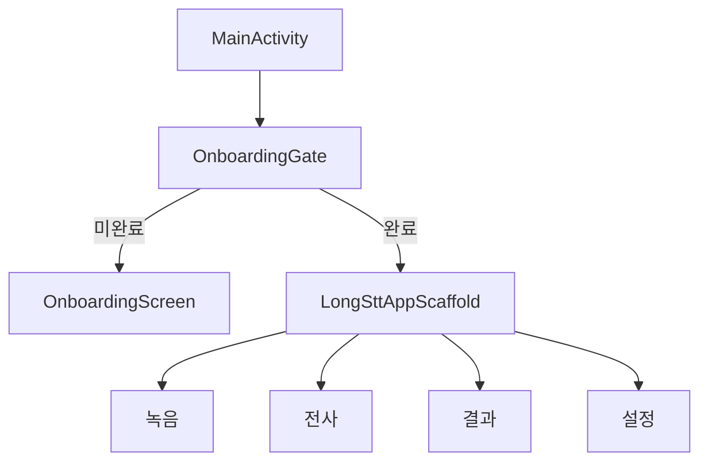

# voice-tracker-find GUI·녹음 기능 이식 정밀 검토

> [!NOTE]
> 이 문서는 구현 전 검토 기록이다. 선별 이식과 후속 검증은 완료됐으며 현재 상태는 [`HANDOFF_20260815.md`](HANDOFF_20260815.md)를 우선한다.

- 작성 일시: 2026-08-07 20:26 KST
- 대상 프로젝트: `coreline-ai/long-stt-android`
- 참조 프로젝트: `coreline-ai/voice-tracker-find`
- 참조 브랜치/커밋: `main` / `34d0b4cee3b1ca61f9093365a90327f6caffa786`
- 검토 방식: 참조 저장소 전체 clone 후 Android 소스, 설계 문서, 에셋 manifest, 단위·실기기 QA 기록을 현재 코드와 대조
- 문서 성격: 구현 전 범위·구조·우선순위 결정안. 아직 참조 코드나 에셋을 현재 앱에 복사하지 않았다.

## 1. 결론

`voice-tracker-find`를 통째로 병합하면 안 된다. 현재 앱에는 이미 장시간 Whisper 전사,
전사 체크포인트, 오디오·모델 보관함, 결과 보관함, Codex 연결 모듈이 존재한다. 참조 앱의
Room/Hilt/WorkManager/서버 동기화/노트/로컬 AI 구조를 함께 가져오면 기능 중복과 상태 소유권
충돌이 크게 늘어난다.

권장안은 다음 세 부분만 선별 이식하는 것이다.

1. **경험·GUI 계층**: Quiet Archive 디자인 토큰, 2단계 온보딩, 하단 탭 구조, 녹음 첫 화면,
   실제 음량 파형, 큰 녹음 제어, 저장 공간·최근 녹음 상태 표현
2. **녹음 안전 계층**: microphone foreground service, 명령 직렬화, `.part → 확정 파일`,
   주기적 청크 마감, 비정상 파일 격리, bounded wake lock, 중단 복구
3. **현재 앱 연결 계층**: 확정된 녹음 청크를 기존 `MediaLibraryStore`에 등록하고,
   신규 녹음 그룹 전사 coordinator가 기존 단일 파일 `TranscriptionService`를 순차 호출해
   하나의 보관함 항목으로 결합

초기 진입 흐름은 **온보딩 → 녹음 탭**으로 하고, 전체 정보 구조는
`녹음 / 전사 / 보관함 / 설정` 4개 탭을 권장한다. 현재 한 화면에 쌓여 있는 기기 정보,
Codex 연결, 모델, 오디오, 실행, 결과 카드는 각 탭의 목적에 맞게 분리한다.

## 2. 검토 기준선

### 2.1 참조 앱

| 항목 | 확인 값 | 이식 판단 |
|---|---|---|
| Android package | `com.thinktank.recorder.next` | package 이름은 이식하지 않음 |
| SDK | min 26, compile/target 35 | 현재 앱의 SDK 34를 즉시 올릴 이유는 없음 |
| UI | Compose + Navigation Compose | Navigation만 최소 추가 권장 |
| DI/DB | Hilt + Room | 현재 앱에는 도입하지 않음 |
| background | WorkManager + recorder FGS | recorder FGS만 선별 적용 |
| 녹음 | MediaRecorder AAC, AudioRecord WAV fallback | 장치 호환성 패턴 적용 |
| 저장 안전 | `.part`, finalize, SHA-256, quarantine, reconcile | 핵심 P0 이식 대상 |
| 실기기 근거 | Samsung SM-S931N, Android 16/API 36 short smoke 통과 | 동일 계열 기기 QA의 출발점으로 활용 |

### 2.2 현재 앱

| 항목 | 현재 상태 | 필요한 변화 |
|---|---|---|
| 화면 구조 | `SttBenchmarkScreen.kt` 단일 세로 스크롤 | App root, navigation, 화면별 ViewModel 분리 |
| 디자인 | 기본 Material 3 청색/보라 계열 카드 UI | Quiet Archive 토큰을 현재 제품 문맥에 맞게 재정의 |
| 오디오 입력 | 시스템 picker로 기존 파일 import | 마이크 녹음과 녹음 세션 보관 추가 |
| 오디오 저장 | 앱 내부 복사 후 `MediaLibraryStore` 원자 인덱스 등록 | 녹음 원본·청크·출처 메타데이터 확장 |
| 장시간 작업 | `TranscriptionService`, dataSync FGS, checkpoint | 녹음 FGS와 실행 상호 배제 필요 |
| 권한 | 오디오 읽기, 알림, dataSync FGS | `RECORD_AUDIO`, `FOREGROUND_SERVICE_MICROPHONE` 추가 |
| 보관함 | 전사 세션·결과 보관함 존재 | 녹음과 전사를 세션 단위로 그룹화 |
| 인증/요약 | Codex OAuth 연동 진행 중 | 첫 화면에서 제거하고 설정·결과 문맥으로 이동 |

## 3. 참조 GUI 분석

### 3.1 경험 방향: Quiet Archive

참조 앱은 AI 기능을 앞세우지 않고, 사용자의 말을 잃지 않고 보관하는 조용한 개인 아카이브로
정의되어 있다. 현재 앱에도 이 방향이 적합하지만, 제품 문구는 “서버 업로드 후 노트”가 아니라
“녹음 → 로컬 Whisper 전사 → 선택적 요약”으로 바꿔야 한다.

적용할 원칙은 다음과 같다.

- 시작/정지는 화면에서 가장 분명한 단일 주 동작으로 제공한다.
- `준비 중 / 녹음 중 / 파일 마감 중 / 저장 완료 / 실패`를 색만이 아니라 텍스트·아이콘으로 표시한다.
- 이미지는 분위기와 빈 상태만 보조하며 권한·오류·기능 의미를 이미지에 의존하지 않는다.
- 설정은 카드 대시보드가 아니라 section list로 만든다.
- 실패 시 임시 녹음 파일과 이미 완료된 청크를 우선 보존한다.
- 전사와 외부 요약 여부를 명시하여 로컬 처리와 외부 전송 경계를 오해하지 않게 한다.

### 3.2 온보딩

참조 구현은 전체 화면 이미지, 하단 gradient, `1 / 2` 진행 표시, editorial heading,
본문, 다음/시작 버튼으로 구성된 2페이지다. 완료 상태를 영구 저장해 이후에는 바로 앱으로 진입한다.

현재 앱용 권장 문구와 동작:

| 페이지 | 제목 | 핵심 설명 | 완료 전 구현 조건 |
|---|---|---|---|
| 1 | 긴 대화를 안전하게 담습니다 | 화면을 벗어나도 녹음을 유지하고, 완료된 청크만 보관 | microphone FGS와 청크 finalize가 실제 동작해야 함 |
| 2 | 녹음에서 전사와 요약까지 | 앱 내부 Whisper 전사, 사용자가 선택할 때만 외부 요약 | 로컬/외부 처리 경계 문구 검토 |

권장 세부사항:

- `DataStore`를 새로 도입하지 않고 현재 경량 구조와 맞춘 `AtomicFile` 또는
  `SharedPreferences` 단일 boolean으로 `onboardingComplete`를 저장한다.
- 첫 실행에서 권한을 한꺼번에 요청하지 않는다. 마이크 버튼을 누른 시점에 마이크 권한을 요청한다.
- 알림 권한은 background 녹음이 필요한 이유와 함께 요청한다.
- 녹음 엔진이 완성되기 전에는 온보딩에 “화면이 꺼져도 계속 녹음”을 노출하지 않는다.
- 설정에 “소개 다시 보기”를 제공한다.

### 3.3 녹음 첫 화면

참조 화면의 핵심 구성은 다음과 같다.

1. 약 250dp 높이의 hero 이미지와 하단 scrim
2. hero 위 상태 pill과 48~56sp tabular timer
3. 실제 amplitude를 반영하는 얇은 `SoundThread`
4. 176~200dp 범위의 큰 녹음/정지 control
5. 현재 상태 안내와 오류·권한 안내
6. 저장 공간, 최근 녹음, 진단 영역
7. 하단 탭 바

현재 앱 적용 시 다음과 같이 조정한다.

- 업로드 큐와 서버 연결 상태는 제거한다.
- 최근 녹음은 “녹음 세션” 단위로 묶고 청크 수·총 길이·파일 크기·전사 상태를 표시한다.
- 최근 녹음의 주 동작은 `전사 시작`, 보조 동작은 `재생`, `이름 변경`, `삭제`로 한다.
- 설정된 Whisper 모델이 없으면 녹음은 허용하되 전사 버튼에서 모델 설치 안내를 한다.
- 녹음 버튼과 “오디오 가져오기” 버튼이 경쟁하지 않게 가져오기는 `전사` 탭에 둔다.
- hero는 화면 상단 약 30~35%까지만 사용해 작은 화면에서도 녹음 버튼과 상태가 첫 viewport에 남게 한다.

### 3.4 화면 상태 모델

UI는 서비스 존재 여부나 파일명으로 상태를 추측하지 말고 구조화된 상태를 사용한다.

| 상태 | 사용자 표시 | 허용 동작 |
|---|---|---|
| `UNSUPPORTED` | 이 기기에서 마이크 입력을 사용할 수 없음 | 파일 가져오기 이동 |
| `PERMISSION_REQUIRED` | 마이크 권한 필요 | 권한 요청, 파일 가져오기 |
| `IDLE` | 녹음 준비됨 | 녹음 시작 |
| `PREPARING` | 마이크와 저장 공간 확인 중 | 중복 시작 차단 |
| `RECORDING` | 녹음 중 + 실제 경과 시간 | 정지 |
| `FINALIZING` | 마지막 파일을 안전하게 저장 중 | 앱 종료·재시작 유도 금지, 중복 정지 차단 |
| `SAVED` | 녹음 저장 완료 | 전사 시작, 재생, 이름 변경 |
| `FAILED` | 보존된 청크와 실패 원인 표시 | 재시도, 보관함 확인 |

추가 표시 정보:

- 현재 세션 경과 시간과 현재 청크 경과 시간은 구분한다.
- 파형은 48개 내외 샘플을 120~250ms 간격으로 갱신하되 화면을 벗어나면 UI 샘플링을 중단한다.
- TalkBack에는 파형 자체가 아니라 “입력 음량 낮음/보통/높음” 같은 요약 설명을 제공한다.
- reduced motion에서는 파형 애니메이션을 정적 level과 상태 텍스트로 대체한다.

### 3.5 디자인 시스템

참조 토큰을 기반으로 현재 앱에 별도 의미 토큰을 만든다.

| 토큰 | Dark | Light | 역할 |
|---|---:|---:|---|
| ArchiveInk | `#151614` | `#24241F` | 어두운 배경·본문 |
| ArchivePaper | `#EEE8DC` | `#F7F3EA` | 결과·상세 표면 |
| ArchiveCopper | `#C07148` | `#A95632` | 녹음·주요 동작 |
| ArchiveMoss | `#7E8C78` | `#5F6D58` | 완료·안정 |
| ArchiveFog | `#A9AAA3` | `#6E706A` | 보조 정보 |
| ArchiveError | `#D06A60` | `#A73F39` | 오류 |
| ArchiveHairline | `#343530` | `#DDD6CA` | divider |

- UI·숫자·상태는 Pretendard, 짧은 소개 heading은 MaruBuri를 권장한다.
- timer에는 tabular number를 적용한다.
- spacing은 4/8/12/16/24/32/48dp, 터치 영역은 최소 48×48dp다.
- 화면 전환은 180~240ms, 녹음 상태 전환은 220~320ms 범위로 제한한다.
- 지속 pulse/glow, parallax, 장식 Lottie는 사용하지 않는다.
- 카드 남용을 줄이고 section label + hairline divider를 기본 정보 구조로 사용한다.

## 4. 녹음 엔진 정밀 분석과 적용안

### 4.1 참조 구현에서 반드시 가져올 패턴

| 패턴 | 참조 동작 | 현재 앱 적용 이유 |
|---|---|---|
| foreground 즉시 진입 | `ACTION_START` 직후 microphone FGS 시작 | Android의 FGS 시작 제한 준수 |
| 명령 직렬화 | FIFO actor가 START/STOP/completion 처리 | 빠른 연타·순서 역전 방지 |
| `START_NOT_STICKY` | 시스템 임의 재시작 시 녹음 자동 재개 안 함 | 사용자 동의 없는 마이크 재시작 방지 |
| 임시 파일 | `*.m4a.part` 또는 `*.wav.part` | 미완료 파일을 정상 파일로 노출하지 않음 |
| 주기적 청크 | 설정된 시간마다 stop/finalize 후 다음 청크 | 장시간 녹음 전체 손실 범위 제한 |
| 확정 | recorder stop/release 후 rename, duration/size/SHA 기록 | 파일 무결성과 추적성 확보 |
| 격리 | 실패·중단된 `.part`를 quarantine으로 이동 | 원본 보존과 정상 보관함 오염 방지 |
| reconcile | 시작 시 미완료 청크와 실제 파일 대조 | 프로세스 중단 뒤 일관성 회복 |
| codec fallback | AAC 제약 → AAC 기본 → PCM WAV | 제조사별 MediaRecorder 설정 실패 대응 |
| wake lock 제한 | 청크 길이 + 2분 timeout | 무제한 wake lock 방지 |
| 알림 정지 action | ongoing notification에서 정지 | background/잠금 화면 제어 |
| 종료 정리 | `NonCancellable`에서 finalize·상태·lock 정리 | 사용자 취소 중 terminal 상태 유실 방지 |

### 4.2 현재 앱용 녹음 형식과 청크 정책

권장 기본값:

- 우선 형식: MPEG-4 container + AAC, mono, 요청값 16kHz/32kbps
- 장치가 제약을 거부하면 mono AAC 기본값으로 재시도
- 최종 fallback: 16kHz/16-bit/mono PCM WAV
- 기본 청크 길이: **20분**
- 사용자 설정은 초기 버전에서 숨기고, 안정화 후 5/20/60분 선택을 검토
- finalize 후 실제 codec/sample rate/channel/duration을 `MediaExtractor`로 읽어 메타데이터에 저장

20분 청크를 권장하는 이유:

- 6시간 단일 임시 파일 전체를 잃을 위험을 약 20분 범위로 제한한다.
- 현재 전사 엔진의 batch 입력과 자연스럽게 연결할 수 있다.
- background service와 파일 finalize를 반복 검증하기 쉽다.
- PCM fallback에서 비정상적으로 큰 단일 WAV가 만들어지는 위험을 줄인다.

주의: WAV fallback은 약 115MB/시간(16kHz, mono, 16-bit)이므로 여유 공간 사전 검사와
청크별 재검사가 필수다. 제조사 codec가 요청값을 그대로 따르지 않을 수 있으므로 확정 파일의
실제 format을 검사해야 한다.

### 4.3 권한과 manifest

추가 대상:

```xml
<uses-feature
    android:name="android.hardware.microphone"
    android:required="false" />
<uses-permission android:name="android.permission.RECORD_AUDIO" />
<uses-permission android:name="android.permission.FOREGROUND_SERVICE_MICROPHONE" />
```

```xml
<service
    android:name=".recording.RecorderService"
    android:exported="false"
    android:foregroundServiceType="microphone"
    android:stopWithTask="false" />
```

참조 앱과 달리 microphone feature는 `required=false`를 권장한다. 마이크가 없는 기기에서도
기존 파일 가져오기와 STT는 계속 사용할 수 있어야 하기 때문이다. 권한은 녹음 시작 동작에서만
요청하고, 영구 거절 시 시스템 설정 이동과 파일 가져오기 대안을 제공한다.

### 4.4 STT 서비스와의 충돌 방지

현재 앱에는 이미 dataSync 타입의 `TranscriptionService`가 있다. 새 `RecorderService`와
알림 ID·채널·action namespace를 완전히 분리해야 한다.

권장 실행 정책:

- `DeviceWorkCoordinator`가 `IDLE / RECORDING / TRANSCRIBING / SUMMARIZING` owner를 원자적으로 관리한다.
- 녹음 준비·녹음·마감 중에는 STT와 요약 시작을 차단한다.
- STT 또는 요약 중에는 녹음 시작을 차단하고 현재 작업과 중지 방법을 안내한다.
- 기술적으로 동시 실행이 가능하더라도 CPU·열·I/O·오디오 품질을 위해 제품 초기 버전은 상호 배제한다.
- service 종료만으로 owner를 해제하지 않고 terminal checkpoint 저장 성공 후 해제한다.

## 5. 데이터 연결 설계

### 5.1 통째로 Room을 도입하지 않는 이유

현재 앱은 `AtomicFile` 기반의 `MediaLibraryStore`와 `TranscriptionSessionStore`를 이미 사용한다.
녹음 하나를 위해 Hilt, Room, KSP, WorkManager와 참조 앱의 upload schema까지 들여오면 빌드와
마이그레이션 부담이 커진다. 녹음 기능은 현재 저장 방식에 맞춘 작은 저장소로 구현하는 편이 안전하다.

### 5.2 권장 저장 구조

```text
files/
  recordings/
    <recording-session-id>/
      rec_<time>_<chunk-id>.m4a.part
      rec_<time>_<chunk-id>.m4a
      quarantine/
  recording_sessions/
    <recording-session-id>.json
  media_library.json
  stt_sessions/
```

새 `RecordingSessionStore`의 최소 메타데이터:

- `schemaVersion`, `sessionId`, `state`, `startedAt`, `stoppedAt`
- `currentChunkId`, `lastError`
- 청크별 `id`, `sequence`, `path`, `state`, `createdAt`, `finalizedAt`
- `durationMs`, `sizeBytes`, `sha256`, `container`, `codec`, `sampleRate`, `channels`
- 대응하는 `mediaEntryId`와 이후 `transcriptionSessionId`

`MediaLibraryStore.AudioEntry` 권장 확장:

- `source`: `IMPORTED` 또는 `RECORDED`
- `recordingSessionId`: 같은 녹음 세션의 청크 그룹 ID
- `sequence`: 청크 순서
- `sha256`, `container`, `codec`

읽기 호환을 위해 새 필드는 기본값을 갖게 하고 schema version을 올린다. 기존 6시간 오디오와
전사 체크포인트 파일은 마이그레이션 명목으로 다시 쓰지 않는다.

### 5.3 녹음에서 전사까지의 흐름


핵심 규칙:

- `.part`, quarantine, 0바이트 파일은 `MediaLibraryStore`에 등록하지 않는다.
- 현재 `runBatchBenchmark()`는 입력이 2개 이상이면 명시적으로 거부하므로 기존 batch STT가
  있다고 가정하면 안 된다. 녹음 세션의 READY 청크를 sequence 순서로 하나씩 실행하고 부모
  상태를 저장하는 `RecordingTranscriptionCoordinator`와 group checkpoint를 새로 구현한다.
- 일부 청크만 보존된 실패 세션도 사용자가 명시적으로 선택하면 보존된 범위만 전사할 수 있게 한다.
- 녹음 원본 삭제와 전사 결과 삭제를 분리한다.
- 전사 결과가 연결된 원본을 삭제할 때 영향 범위를 확인하고 확인 dialog를 표시한다.

## 6. 권장 화면 정보 구조

### 6.1 App root



| 탭 | 포함 기능 | 현재 화면에서 이동할 요소 |
|---|---|---|
| 녹음 | hero, 상태, timer, waveform, 녹음 제어, 저장공간, 최근 세션 | 신규 |
| 전사 | 오디오 가져오기/선택, 모델 선택, 전사 계획·시작·진행 | 모델/오디오/Run 카드 |
| 결과 | 전사 세션, 전체 텍스트, 이후 요약·공유 | ResultLibrary/Result 카드 |
| 설정 | 녹음, 저장, 모델 관리, Codex 연결, 소개 다시 보기, 진단 | 기기 정보, Codex 카드, 모델 관리 일부 |

하단 탭은 화면 상태를 복원하고, 녹음 중 다른 탭으로 이동해도 FGS 상태가 유지되도록 한다.
단, 녹음 중인 탭에는 작은 활성 표시를 제공하고 앱을 닫는 동작과 녹음 정지를 혼동하지 않게 한다.

### 6.2 코드 분리안

| 신규/변경 파일 | 책임 |
|---|---|
| `ui/LongSttApp.kt` | 온보딩 gate, root scaffold, navigation |
| `ui/navigation/AppDestination.kt` | 4개 목적지와 route 정의 |
| `ui/onboarding/OnboardingScreen.kt` | 2페이지 소개 UI |
| `ui/onboarding/OnboardingStore.kt` | 완료 상태 저장 |
| `ui/recording/RecordingScreen.kt` | 녹음 상태 렌더링과 permission launcher |
| `ui/recording/RecordingViewModel.kt` | recording snapshot을 UI state로 변환 |
| `ui/recording/RecordingComponents.kt` | SoundThread, timer, record control, status pill |
| `recording/RecorderController.kt` | start/stop intent만 담당 |
| `recording/RecorderService.kt` | recorder lifecycle과 청크 실행 owner |
| `recording/RecorderCommandActor.kt` | start/stop 직렬화 |
| `recording/RecordingFileManager.kt` | `.part`, finalize, hash, quarantine, recovery |
| `data/RecordingSessionStore.kt` | 녹음 세션 원자 메타데이터 |
| `core/DeviceWorkCoordinator.kt` | 녹음/STT/요약 상호 배제 |
| `ui/transcription/TranscriptionScreen.kt` | 현재 모델·오디오·실행 영역 분리 |
| `ui/library/LibraryScreen.kt` | 녹음·전사 결과 그룹 보관함 |
| `ui/settings/SettingsScreen.kt` | 모델·인증·권한·진단 section |
| `ui/theme/Theme.kt` | Quiet Archive semantic tokens, typography, system bars |

현재 `SttViewModel`에는 녹음 책임을 추가하지 않는다. 녹음과 전사는 별도 ViewModel로 유지하고
`MediaLibraryStore`와 `DeviceWorkCoordinator` 계약만 공유한다.

## 7. 적용 항목 전체 분류

### 7.1 P0 — 기능을 켜기 전에 반드시 적용

| ID | 적용 항목 | 적용 방식 |
|---|---|---|
| P0-01 | 디자인·navigation 구조 | theme/root scaffold/4탭 신설 |
| P0-02 | 2페이지 온보딩 | LongSTT 문구로 재작성, 완료 상태 저장 |
| P0-03 | microphone 권한·기기 지원 검사 | action 시점 권한 요청, micless fallback |
| P0-04 | RecorderService | 별도 microphone FGS와 알림 채널 |
| P0-05 | start/stop 명령 직렬화 | FIFO actor와 중복 명령 idempotency |
| P0-06 | 안전한 파일 수명주기 | `.part → final`, quarantine, reconcile |
| P0-07 | 장시간 청크 마감 | 기본 20분, 완료 청크 보존 |
| P0-08 | 녹음 checkpoint | `AtomicFile` 기반 session/chunk 상태 |
| P0-09 | 작업 상호 배제 | 녹음/STT/요약 coordinator |
| P0-10 | 실제 amplitude UI | 서비스 runtime flow를 화면에 연결 |
| P0-11 | 기존 보관함 연결 | READY 청크만 등록, 세션 그룹 유지 |
| P0-12 | 녹음 그룹 전사 | 신규 coordinator가 기존 단일 파일 Service를 순차 실행 |
| P0-13 | terminal 안전성 | stop/cancel/error에서 `NonCancellable` finalize |
| P0-14 | 접근성 | 상태 텍스트, 48dp, TalkBack, reduced motion |

### 7.2 P1 — 첫 안정화 릴리스에 권장

| ID | 적용 항목 | 적용 방식 |
|---|---|---|
| P1-01 | 저장공간 preflight | 시작 전/청크마다 예상 필요량 확인 |
| P1-02 | 최근 녹음 세션 | 길이, 청크, 크기, 전사 상태 표시 |
| P1-03 | 재생·이름 변경·삭제 | 원본/결과 영향 분리 |
| P1-04 | 알림 정지 action | 잠금·홈에서도 확정 종료 가능 |
| P1-05 | 실제 codec 검사 | finalize 후 container/track 메타데이터 확인 |
| P1-06 | PCM fallback | 대표 Samsung 외 장치 호환성 확보 |
| P1-07 | light/dark/system inset | 360×800, 412×915, landscape 검증 |
| P1-08 | font scale | 100/130/200%에서 제어·본문 접근성 |
| P1-09 | 소개 다시 보기 | 설정 route 제공 |
| P1-10 | 에셋 provenance 검사 | manifest/hash/license를 preBuild gate로 연결 |
| P1-11 | Compose UI 테스트 | 온보딩·권한·상태별 화면·navigation |
| P1-12 | Samsung 반복 검증 | START/STOP 20회, background, lock, recreation |

### 7.3 P2 — 안정화 후 검토

- 청크 길이 사용자 설정
- Bluetooth/USB 마이크 route 표시·선택 정책
- 녹음 중 marker/bookmark
- 청크 자동 병합 또는 외부 공유용 단일 파일 export
- 녹음 session별 자동 전사 정책
- notification에 pause/resume 추가
- 녹음 검색·태그·즐겨찾기
- 장기 8시간/24시간 soak와 배터리·열 telemetry

### 7.4 현재 범위에서 제외

- 참조 앱의 서버 receiver/backend
- upload queue, retry lease, server hash, conflict 처리
- Notes Markdown 편집기와 WikiLink
- Local AI/SenseVoice/Gemma 화면
- 예약 시간 창 녹음
- Hilt/Room/KSP/WorkManager의 일괄 도입
- 참조 앱 package/application class/build variants의 복사
- 참조 앱 OAuth/cloud summary 모듈의 중복 이식

## 8. 직접 재사용·수정 재사용·제외 판단

| 분류 | 대상 | 판단 |
|---|---|---|
| 비교적 직접 재사용 | `SoundThread`, 큰 `RecordControl`, `StatusPill`, duration formatter | package/theme/accessibility를 현재 앱에 맞게 변경 |
| 구조 재사용 | 2페이지 onboarding layout, bottom navigation, section list | 문구·route·상태 소유권 전면 수정 |
| 큰 폭 수정 | `RecordingScreen`, `RecordingViewModel`, permission flow | upload/server/Room 의존 제거 |
| 패턴 재사용 | actor, recorder fallback, `.part` finalize, quarantine, wake lock | 현재 AtomicFile store와 coordinator 계약으로 재작성 |
| 재사용 금지 | Room entities/DAO 전체, repository, upload worker, server gateway | 현재 앱과 책임·데이터 모델이 다름 |
| 재사용 금지 | Notes/Settings/Local AI 전체 화면 | 현재 제품 범위와 다름 |

## 9. 에셋·폰트·라이선스 판단

참조 저장소의 `drawable-nodpi`에는 생성형 이미지 7개, 총 243,686 bytes가 있고
`asset-manifest.json`에 생성 prompt, source ID, 작성 주체, 용도, 크기, SHA-256이 기록돼 있다.
Pretendard와 MaruBuri는 OFL 1.1 안내 및 배포용 notice를 포함한다.

다만 검토한 참조 commit의 **저장소 루트에서 전체 코드 LICENSE 파일은 확인되지 않았다**.
같은 조직의 저장소라도 이를 자동으로 복제 허가로 해석하면 안 된다.

권장 gate:

1. 참조 코드·생성 에셋의 현재 프로젝트 재사용에 대한 저장소 소유자/조직 내부 승인을 확인한다.
2. 승인되면 원본 commit과 파일 목록을 `docs/ASSET_PROVENANCE.md`에 남긴다.
3. 에셋을 복사한다면 원본 `asset-manifest.json`과 `ASSET_LICENSES.md`를 함께 보존한다.
4. 폰트를 번들하면 OFL 1.1 전문과 copyright notice를 APK assets에 포함한다.
5. 승인이 불명확하면 동일 이미지를 복사하지 않고 LongSTT용 hero/onboarding 이미지를 새로 생성한다.
6. 기능 구현은 이미지 없이 gradient/color placeholder로 먼저 진행할 수 있게 한다.

## 10. 위험과 대응

| 위험 | 심각도 | 대응 |
|---|---|---|
| 녹음 GUI만 먼저 노출해 실제 안전성을 과장 | P0 | engine/finalize gate 전 feature flag로 숨김 |
| START/STOP 연타로 service 상태 역전 | P0 | actor + idempotency 테스트 |
| 6시간 단일 임시 파일 손실 | P0 | 20분 청크 + 매 청크 finalize |
| STT와 녹음 동시 실행으로 열·I/O·품질 저하 | P0 | `DeviceWorkCoordinator` 상호 배제 |
| `.part`가 오디오 보관함에 노출 | P0 | READY 상태만 media 등록 |
| 현재 6시간 결과·체크포인트 손상 | P0 | 기존 파일 read-only, schema 기본값, 회귀 hash 확인 |
| 제조사 encoder가 16k/32kbps를 무시 | P1 | finalize 후 실제 track 검사 |
| PCM fallback 저장공간 폭증 | P1 | 매 청크 preflight, 낮은 공간 즉시 안전 종료 |
| 마이크 FGS 정책·권한 차이 | P1 | Android 13~16 representative test |
| UI 대규모 개편과 OAuth/요약 작업 충돌 | P1 | route별 파일 ownership, 단계별 작은 commit |
| 참조 코드/이미지 재사용 권한 불명확 | P0 gate | 내부 승인 또는 신규 제작 |

## 11. 검증 기준

### 자동 검증

- `RecordingStateReducerTest`: 모든 허용·거부 상태 전이
- `RecorderCommandActorTest`: START/STOP 연타, 오래된 completion 순서
- `RecordingFileManagerTest`: finalize, 0바이트 거부, quarantine, reconcile, hash
- `RecordingSessionStoreTest`: AtomicFile backup 복구, unknown schema 원본 보존
- `MediaLibraryRecordingMigrationTest`: 기존 인덱스 읽기, 녹음 grouping, READY-only 등록
- `DeviceWorkCoordinatorTest`: 녹음/STT/요약 배타 제어와 terminal 해제
- `RecordingScreenTest`: 권한·idle·recording·finalizing·failed 상태
- `OnboardingTest`: 1/2 → 2/2 → app, 재실행 skip, 설정에서 다시 보기
- 기존 `TranscriptionService`/session/store unit 전체 회귀
- Debug/Release assemble, lint, arm64/16KB alignment 회귀

### 실기기 검증

- 고정 serial의 Samsung SM-S931N에서 기존 앱 데이터 백업 후 수행
- 권한 허용/거절/영구 거절
- 실제 마이크 START/STOP 20회
- 홈 이동, 화면 잠금, Activity recreation, process kill 이후 상태
- 알림 정지와 앱 내 정지 결과 일치
- `.part` 생성, 청크 확정, quarantine, 재기동 reconcile
- 20분 경계 전후 청크 수·gap/overlap·duration 확인
- 1시간, 6시간, 이후 8시간 soak
- 녹음 완료 세션 → 그룹 coordinator → 단일 파일 STT 순차 실행 → 통합 보관함 연결
- Bluetooth/USB/전화/알람 interruption은 P1 안정화 항목으로 별도 기록

참조 앱의 Samsung smoke는 짧은 기준선은 통과했지만, 잠금·회전·알림 action·권한 취소,
START/STOP 20회, 5/20/120분 청크, 1/8/24시간 soak를 대체하지 않는다.

## 12. 최종 권장 개발 순서

1. 재사용 승인·UX 범위·정보 구조를 고정한다.
2. 현재 STT 데이터와 미완료 작업을 보호하고 navigation 의존성만 최소 추가한다.
3. Quiet Archive theme, app scaffold, 온보딩, 4개 빈 route를 만든다.
4. 녹음 저장소·file manager·상태 reducer·coordinator를 UI 없이 먼저 완성한다.
5. microphone FGS, actor, AAC/WAV recorder, 청크 finalize를 구현한다.
6. 실제 service state를 녹음 화면에 연결하고 feature flag를 해제한다.
7. 확정 녹음을 `MediaLibraryStore`와 신규 그룹 전사 coordinator에 연결한다.
8. 기존 단일 화면을 전사/결과/설정 route로 분해한다.
9. 접근성·작은 화면·font scale·light/dark·회전 QA를 완료한다.
10. Samsung short smoke → 20회 반복 → 1시간 → 6시간 순으로 승격한다.

상세 체크리스트는 `dev-plan/implement_20260807_202614.md`를 따른다.

## 13. 2026-08-08 포팅 진행 상태

- 위 권장 순서 1~6과 기존 계획 Phase 0~4를 완료했다.
- `SoundThread`, `RecordControl`, `StatusPill`은 현재 Compose/theme/accessibility 계약에 맞춰 신규 작성했다.
- 권한, recorder actor/service, AAC/WAV fallback, `.part` finalize와 recovery는 현재 AtomicFile·coordinator 구조로 재구현했다.
- 제품 Debug에서 직접 녹음 UI가 활성화되었고 service runtime/checkpoint만 source of truth로 사용한다.
- data-safe Samsung 캡처 12개와 테스트 결과는 `README.md`, `docs/screenshots/`, `docs/DEVICE_BASELINE_20260807_1917.md`에 반영했다.
- 아직 직접 포팅하지 않은 핵심 범위는 권장 순서 7의 MediaLibrary·group transcription 통합과 9~10의 최종 장시간 QA다.
